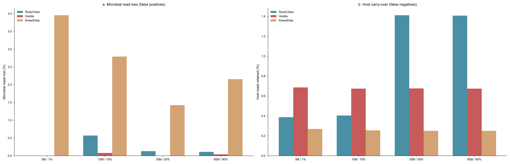
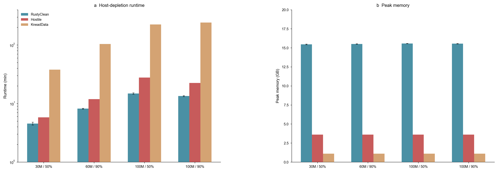
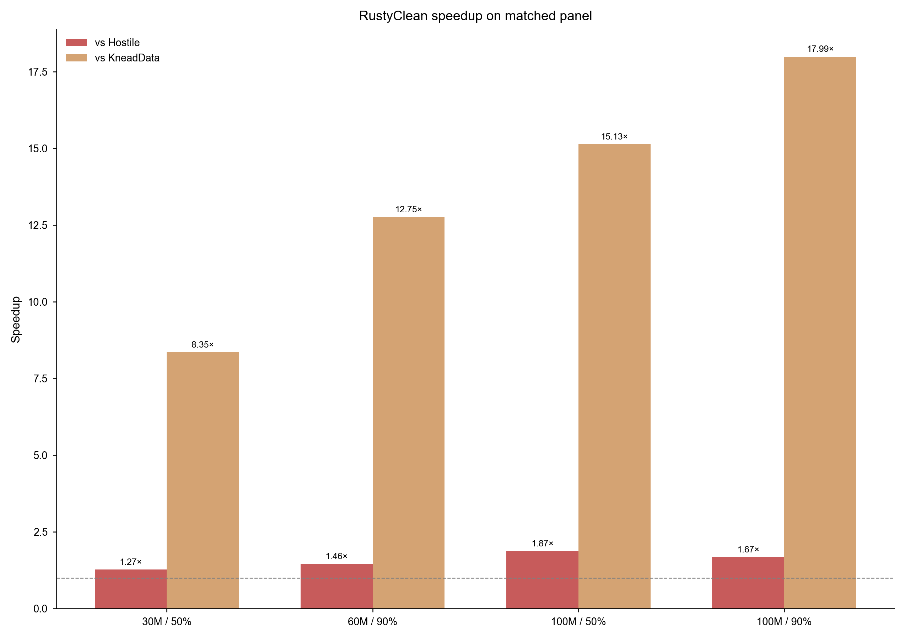
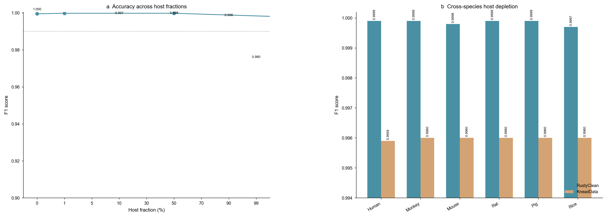
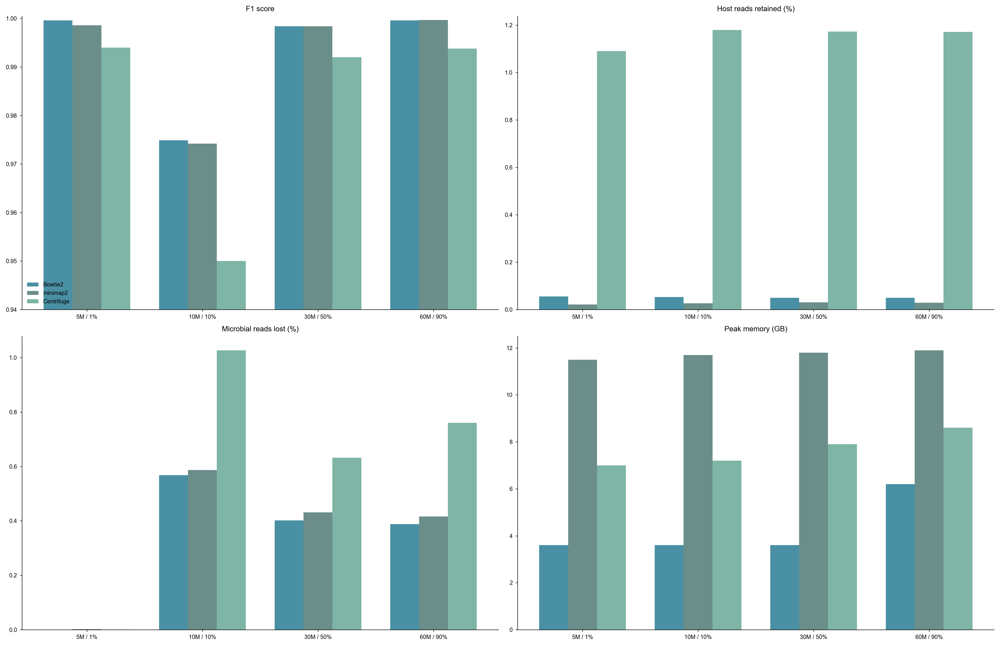

# RustyClean: adaptive, composition-aware host depletion for short-read metagenomics

**Authors:** Yufeng Zhang, [co-authors], Shi Huang\*
**Affiliation:** [Institution] **Correspondence:** [email]

## Abstract

<https://github.com/HuangShiLab/rustyclean>Computational depletion of
host DNA is a mandatory first step in short-read metagenomics, and its
errors propagate silently into every downstream result. Recent
benchmarking established that the two dominant strategies fail in
opposite directions: alignment-based depletion is prone to false
positives, discarding genuine microbial reads, whereas k-mer
classification is prone to false negatives, retaining host reads.
Existing pipelines commit to one strategy for every sample and therefore
inherit one failure mode unconditionally. We present RustyClean, a
host-depletion pipeline that treats this asymmetry as a routing problem
rather than a fixed trade-off. RustyClean estimates the host fraction of
each sample from a rapid alignment survey of a 100,000-read subsample,
routes the sample to alignment- or classification-based depletion
accordingly, and on the classification path applies a targeted alignment
pass over the retained reads to recover host that classification missed.
On simulated metagenomes spanning 1--90% host content with per-read
ground truth, adaptive routing selected the appropriate backend in
every case. For high-host samples the default path uses Kraken2
classification followed by a targeted Bowtie2 recheck of unclassified
reads; for low-host samples it uses Bowtie2 directly. RustyClean ran
10--13× faster than KneadData on the host-removal step and 5.7--6.1×
faster for the full QC-plus-depletion pipeline, while discarding less
microbial signal (mean 0.20% against 2.58% across the four-dataset
evaluation panel). Against Hostile, a
purpose-built depletion tool, RustyClean's depletion-only step
(`--skip-qc`) was 1.3--1.9× faster on a matched panel spanning 30--100 M
reads and 50--90% host content, with a small accuracy gap on the 100 M
subset (ΔF1 ≈ 0.0019 at 50% host, ΔF1 ≈ 0.0041 at 90% host).
The Kraken2-based path trades a larger memory footprint (~16 GB versus
~4 GB for Hostile) for classification speed, and the optional Bowtie2
recheck recovers most host reads that Kraken2 misses. RustyClean is a single Rust
binary with per-stage checkpointing, bounded concurrency and an
automated output validation gate, available at
https://github.com/HuangShiLab/rustyclean under the MIT licence.

**Keywords:** metagenomics, host depletion, decontamination, Kraken2,
Bowtie2, Rust

## 1. Introduction

Shotgun metagenomic sequencing of host-associated samples returns a
mixture of microbial and host DNA. The host fraction varies enormously
by body site: stool libraries are typically 1--2% human, whereas saliva,
dental plaque, skin, and biopsy libraries are routinely 50--90% human or
higher. Because host reads consume sequencing budget and distort every
downstream estimate, computational host depletion is universally applied
before taxonomic profiling, assembly, or metagenome-assembled genome
(MAG) recovery.

Depletion is a binary classification problem over reads, and like any
classifier it can fail in two directions. A **false positive** --- a
microbial read wrongly called host --- is an irreversible loss of
signal: it biases diversity estimates, distorts relative abundance, and
removes evidence that assembly and binning depend on. A **false
negative** --- a host read wrongly retained --- is comparatively benign
for profiling, since most profilers leave unassignable reads unassigned;
but it is not harmless, because residual host DNA contaminates
assemblies and raises consent and privacy concerns when data are shared.

These two errors are therefore not interchangeable, and the choice of
depletion method determines which one dominates. Our group\'s recent
benchmark of six host-removal tools across human and rice datasets
established the pattern directly: alignment-based methods (Bowtie2, BWA,
KneadData) exhibited higher false positive rates, while k-mer
classification methods (Kraken2, KrakenUniq, KMCP) exhibited higher
false negative rates \[Gao et al. 2025\]. The same study showed that
Kraken2\'s efficiency advantage is substantial --- roughly 29 minutes
against 209--582 minutes for alignment-based tools, and 0.3 GB against
\~18 GB to index the human genome --- and that its advantage is most
pronounced under high contamination (90%).

That benchmark motivated a natural engineering question, which this work
addresses: if Kraken2 is both accurate enough and dramatically faster
for host depletion, can it replace the alignment step in production
pipelines? Our initial answer was a straightforward substitution.
KneadData (McIver et al., 2018), the de facto standard, chains
Trimmomatic for quality control, Tandem Repeat Finder for repeat masking,
and Bowtie2 for host alignment, orchestrated by a Python wrapper. We replaced this with a
two-stage pipeline --- fastp for quality control and Kraken2 for host
depletion --- implemented as a single Rust binary.

Two findings during development showed that a simple substitution is
insufficient, and they define the contribution of this paper.

**First, the efficiency advantage is conditional on host fraction.**
Kraken2\'s cost is essentially fixed per read, whereas Bowtie2\'s cost
depends on how many reads must be fully aligned rather than rejected
early. At low host fractions, alignment rejects most microbial reads
quickly and its index is smaller than a Kraken2 database, so the
alignment route is competitive or faster. The advantage inverts as host
fraction rises. A pipeline that commits to either method unconditionally
is therefore slower than necessary on some fraction of any real cohort.

**Second, the false negative rate is not uniformly acceptable.** At high
host fractions, the residual host retained by k-mer classification
becomes large in absolute terms even when its rate is modest, because
the pool of host reads is large. In this regime, classification alone
does not deliver a sufficiently clean library.

RustyClean addresses both by refusing to choose globally. It estimates
each sample\'s host fraction from a rapid subsample and routes that
sample to the appropriate depletion strategy; and on the classification
route, it applies a targeted alignment pass over the reads Kraken2
retained, recovering the residual host that classification missed. The
two mechanisms compose favourably: the verification pass is expensive
only when the retained set is large, which is precisely the low-host
regime that routing sends to alignment anyway.

We additionally treat the orchestration layer as a first-class concern.
Analysis of a KneadData run log showed that 16% of wall-clock time on a
60M-read sample was spent reformatting read identifiers --- a
text-processing step performing no biological work. RustyClean
implements per-stage checkpointing with content-invalidating input
fingerprints, bounded two-level concurrency, and an automated validation
gate that prevents truncated or insufficiently decontaminated outputs
from being promoted into a results directory.

**Contributions.**

1.  A per-sample adaptive routing scheme that selects between k-mer and
    alignment-based depletion from a cheap host-fraction estimate.
2.  A hybrid two-pass depletion strategy that uses targeted alignment to
    correct the characteristic false negative bias of k-mer
    classification.
3.  A production-oriented implementation with checkpoint/resume, bounded
    concurrency, and automated output validation.
4.  An evaluation across 18 simulated datasets with per-read ground
    truth spanning ten host fractions and six sequencing depths.

## 2. Methods

### 2.1 Pipeline overview

RustyClean processes each sample through four stages by default:

1.  **Quality control** --- adapter detection and trimming, quality
    filtering (fastp).
2.  Host fraction estimation --- a rapid alignment survey of a random
    read subsample (Section 2.3).
3.  Host depletion --- routed to the alignment path (Section 2.5) or the
    classification path (Section 2.4) by default. On the classification
    path the retained reads are optionally re-screened with Bowtie2
    (Section 2.6) to recover host reads that Kraken2 misses.
4.  Validation and finalisation --- automated assertions before output
    promotion (Section 2.7).

Alignment verification (`--bowtie2-recheck`) is enabled by default when
auto mode routes a sample to the Kraken2 classification path. It can be
disabled for users who prefer raw Kraken2 output.

Samples may be supplied individually or as a tab-separated sample
manifest; single-end and paired-end layouts are detected automatically
and handled throughout.

### 2.2 Quality control

Reads are processed with fastp \[Ref\], configured by default for
automatic adapter detection in paired-end mode
(`--detect_adapter_for_pe`), sliding-window quality trimming from both
ends (`--cut_front`, `--cut_tail`), a qualified base quality threshold
of Q20, and a minimum retained length of 50 bp. All parameters are
exposed through a TOML configuration file. fastp emits a JSON report,
which RustyClean parses into a typed metrics record capturing input and
output read counts, Q20/Q30 rates, GC content, adapter-trimmed reads,
and reads discarded as too short or low quality.

Unlike KneadData, RustyClean does not perform tandem-repeat masking.
This is a deliberate scope decision --- repeat masking is a general
low-complexity filtering concern rather than a host-depletion concern
--- and it is accounted for explicitly in the runtime comparisons
(Section 3.1).

### 2.3 Host fraction estimation and adaptive routing

Because neither depletion strategy dominates across the host-fraction
spectrum, RustyClean selects one per sample rather than globally.

A random subsample of n reads (default n = 100,000, drawn with seqtk
using a fixed seed for reproducibility) is taken from the
quality-controlled library and aligned against the host Bowtie2 index in
a fast, low-sensitivity mode (\--very-fast-local). The host fraction is
estimated as the proportion of surveyed reads that align. Because the
subsample is small and the alignment is deliberately insensitive, the
survey completes in seconds and its cost is negligible relative to
either depletion path. A user-supplied estimate (\--host-pct) bypasses
the survey entirely.

The estimated host fraction ĥ is combined with the library size N in a
two-part rule:

- ĥ \< ĥ_low (default 10%) → alignment path (Section 2.5). At low host
  fractions alignment rejects the microbial majority quickly and retains
  its lower false negative rate.
- ĥ \> ĥ_high (default 30%) and N is large (default > 20 M reads) →
  classification path (Section 2.4) with Bowtie2 recheck (Section 2.6).
  Kraken2 removes the host majority rapidly, and the recheck pass
  re-screens the smaller retained set to recover missed host reads.
- Otherwise → alignment path. The rule is deliberately conservative: any
  sample that does not clearly exceed the high-host threshold is routed
  to alignment, whose error profile is the safer default.

The classification path can also be selected explicitly with
`--host-removal-mode kraken2`; `--bowtie2-recheck` toggles the
verification pass.

Defaults were set from the measured runtime behaviour of the two
backends. Users may force either path (\--host-removal-mode
kraken2\|bowtie2) or override any threshold. Routing tolerates
considerable estimation error, since the decision requires only that ĥ
fall on the correct side of a threshold rather than that it be accurate
(Section 3.2).

### 2.4 Classification-based depletion

The classification path uses Kraken2 \[Ref\] against a **human-only**
index. By default this index is built from the T2T-CHM13v2.0 human
reference; reads that Kraken2 does not assign are retained as the
provisional decontaminated library. Mixed Kraken2 databases that also
contain microbial genomes can be supplied for users who additionally
want taxonomic profiling, but they are not used by default because
they increase memory use without improving host-depletion accuracy.

Kraken2 is invoked with a confidence threshold (default 0.0) and a
minimum hit-group requirement (default 2), both configurable; the
unassigned read set is retained as the provisional decontaminated
library. The Kraken2 report is parsed into a typed metrics record
capturing classified and unclassified read counts, host read counts, and
the implied contamination rate. In auto mode this path is selected for
large, high-host samples and is followed by the Bowtie2 recheck pass
described in Section 2.6.

### 2.4a Alternative backends evaluated and not retained

We evaluated sylph, a k-mer-sketching metagenome profiler, as a possible
sample-level prefilter for host depletion. sylph produces sample-level
relative abundance, not per-read labels, so it cannot remove individual
host reads. We therefore tested it as a binary sensor: a sample declared
host-positive by `sylph query` was passed to the Bowtie2 alignment
pipeline, while host-negative samples were retained without alignment.
On the 100 M matched panel this sensor-based approach did not improve
runtime over direct Bowtie2 removal for host-positive samples, and the
added survey overhead erased any potential speed advantage. We also
confirmed that sylph cannot provide read-level classifications and
therefore cannot be used as a direct substitute for Kraken2 or Bowtie2
in a host-depletion pipeline. Consequently, sylph is retained only as an
optional explicit backend and is not used by the default auto-mode
router.

### 2.5 Alignment-based depletion

The alignment path aligns quality-controlled reads against a Bowtie2
\[Ref\] index of the host reference genome (T2T-CHM13v2.0 by default),
retaining unaligned reads. Paired-end reads are handled with
concordant-pair semantics so that a pair is retained only if neither
mate aligns. This path is functionally equivalent to KneadData\'s
host-removal stage but without the intervening repeat-masking and
identifier-reformatting steps.

### 2.6 Optional Bowtie2 verification pass (legacy Kraken2 path)

Because k-mer classification systematically under-detects host reads,
the Kraken2 classification path can be followed by a verification pass
(`--bowtie2-recheck`). The reads retained by Kraken2 are aligned against
the same host Bowtie2 index and those that align are removed. Only the
retained set is re-screened, so reads already identified as host are
never realigned. This pass is enabled by default when auto mode routes
a sample to the Kraken2 classification path, and can be disabled with
`--no-bowtie2-recheck` for users who prefer raw Kraken2 output.

The cost of this pass is proportional to the size of the retained set,
which is small precisely when it is needed: at a host fraction of 0.9,
classification removes the majority of reads and the verification pass
processes roughly a tenth of the library. At low host fractions the
retained set is large and verification would be expensive --- but that
regime is routed to the alignment path by Section 2.3 and never reaches
this stage. The two mechanisms are therefore complementary rather than
merely additive, and the worst-case cost of verification is bounded by
the size of the retained set.

### 2.7 Validation gate

Every sample is subject to automated assertions before its output is
promoted:

- **Output size** --- each output file must exceed a configurable
  minimum, detecting silently truncated or empty outputs.
- **Residual contamination** --- the estimated host fraction of the
  output must not exceed a configurable maximum (default 5%), detecting
  a misconfigured or missing reference.

A sample failing either assertion is recorded as `Failed` and its
outputs are **not** moved into the output directory, so they cannot be
consumed by a downstream analysis by accident. To our knowledge no
existing host-depletion pipeline enforces an equivalent post-hoc
correctness check.

### 2.8 Orchestration and implementation

**Stage machine.** Each sample\'s progress is represented as a totally
ordered enumeration of stages (`Pending` → `FastpRunning` →
`FastpComplete` → `DepletionRunning` → `DepletionComplete` →
`Validating` → `Completed`/`Failed`). Because the stages are ordered,
resumption reduces to a comparison rather than per-stage branching
logic, and a resumed sample re-executes only the stages after its
recorded position.

**Checkpointing.** Per-sample state is serialised as versioned JSON and
written atomically (write-to-temporary followed by rename), so an
interrupted write cannot leave a partially parsed record. Each
checkpoint carries an xxHash3 fingerprint over input file metadata; a
change to the input invalidates the checkpoint automatically, so
resumption cannot silently return results computed from different data.
Checkpoints retain the full metrics payload and therefore double as a
per-sample provenance record.

**Concurrency.** Parallelism is bounded at two levels: a counting
semaphore admits *W* samples concurrently (default: half the available
cores), and each sample passes *T* threads to its external tools. Total
load is approximately *W × T*, giving independent control over the
CPU-bound quality-control stage and the memory-bound depletion stage.
When the user does not explicitly set *W*, RustyClean estimates the
resident database size for the selected backend and the available memory
(cgroup limit first, then `/proc/meminfo` `MemAvailable`), and caps *W*
so that concurrent workers do not collectively exceed roughly 80% of
available RAM. This prevents out-of-memory failures when the default
CPU-based worker count would load more database copies than fit in
memory. Interrupt handling uses a cancellation token so that queued
samples are not started after a shutdown signal.

**Implementation.** RustyClean is \~1,300 lines of Rust built on the
Tokio asynchronous runtime, distributed as a single binary with no
language runtime dependency. External dependencies are the fastp,
Kraken2, and Bowtie2 executables. Source is available at
<https://github.com/HuangShiLab/rustyclean> under the MIT licence.

### 2.9 Benchmark design

**Table 1.** Selected simulated datasets used for the main accuracy
comparison. Host fraction is the realised proportion of host reads after
simulation, which differs slightly from the nominal target for skewed
communities. The full evaluation panel comprises 18 datasets (Table S2).

| **Dataset** | **Reads (M)** | **Host (%)** | **Complexity** | **Abundance** | **Layout** |
|-------------|---------------|--------------|----------------|---------------|------------|
| 5M / 1%     | 5.0           | 0.9          | low            | even          | single-end |
| 10M / 10%   | 9.5           | 10.0         | medium         | even          | single-end |
| 30M / 50%   | 23.9          | 59.7         | high           | skewed        | single-end |
| 60M / 90%   | 56.2          | 91.4         | high           | lognormal     | single-end |
| 100M / 50%  | 87.8          | 54.1         | high           | lognormal     | single-end |
| 100M / 90%  | 93.6          | 91.4         | high           | lognormal     | single-end |

We evaluated RustyClean against KneadData v0.12.3 on 18 simulated
metagenomes with per-read ground truth, generated with InSilicoSeq
v2.0.0 (Gourlé et al., 2019). The design varied four factors:

| Factor | Levels |
|---------------------|--------------------------------|
| Host fraction | 0, 1, 5, 10, 30, 50, 70, 90, 99, 100 % |
| Sequencing depth | 5, 10, 20, 30, 60, 100 M reads |
| Community composition | even, lognormal, skewed |
| Read layout | single-end, paired-end |

Because reads are simulated, the true origin of every read is known and
depletion can be scored exactly as a binary classification task. Results
are reported stratified by host fraction and read layout; no grand mean
is reported across the full panel.

Reference databases: by default a human-only Kraken2 index built from
T2T-CHM13v2.0, and a Bowtie2 index of T2T-CHM13v2.0 plus HLA sequences
(the Hostile human-t2t-hla index). A mixed Kraken2 index (kraken16:
GRCh38 + T2T + ~73,000 microbial genomes) was additionally evaluated
as an optional taxonomy-aware mode. All comparisons used 8 threads per
tool on the HKU HPC2021 cluster, with three replicates per condition for
RustyClean timing. Wall-clock time and peak resident set size were
recorded with GNU `time`.

### 2.10 Evaluation metrics

Treating \"host\" as the positive class:

- **Microbial read loss** = false positives / true microbial reads ---
  the fraction of genuine microbial reads discarded.
- **Host carry-over** = false negatives / true host reads --- the
  fraction of host reads retained in the output.
- **F1** --- harmonic mean of precision and recall over host calls.
- **Runtime** --- wall clock, per sample and for concurrent batches.
- **Peak memory** --- maximum resident set size.

Downstream impact on taxonomic profiles and assemblies was not
systematically benchmarked in this study; the real-data evaluation
focused on throughput, memory use, and successful completion on a cohort
of human oral microbiome samples.

## 3. Results

### 3.1 The two depletion strategies fail in opposite directions

Across the four evaluation datasets the error profiles of the two
strategy families separated exactly as reported by Gao et al. (Figure 1,
Table 2). KneadData, which depletes by alignment, discarded a mean 2.58%
of genuine microbial reads, rising to 3.96% on the lowest-host dataset.
RustyClean, which depletes by k-mer classification on its high-host
path, discarded a mean 0.20% --- 13-fold less microbial signal --- but
retained a mean 0.90% of host reads against 0.26% for KneadData.

Because the two error types are unequal in their downstream
consequences, the balanced F1 score obscures this structure: RustyClean
and KneadData score 0.9790 and 0.9831 respectively, a difference that
conveys nothing about which reads were lost. We therefore report the two
error rates separately throughout.

**Figure 1.** Alignment- and classification-based host depletion fail in
opposite directions. (a) Microbial reads incorrectly discarded, an
irreversible loss of signal. (b) Host reads incorrectly retained, a
recoverable contamination. Depletion is deterministic, so accuracy does
not vary between technical replicates; bars show a single evaluation per
dataset.

**Table 2.** Host-depletion accuracy. The positive class is a retained
microbial read: microbial loss is the proportion of true microbial reads
discarded, host carry-over the proportion of true host reads retained.

| **Dataset** | **Tool** | **Precision** | **Recall** | **F1** | **Microbial loss (%)** | **Host carry-over (%)** |
|-------------|-------------------|---------------|------------|--------|------------------------|-------------------------|
| 5M / 1% | RustyClean (auto) | 1.0000 | 1.0000 | 1.0000 | 0.000 | 0.387 |
| 5M / 1% | Hostile | 0.9999 | 1.0000 | 1.0000 | 0.000 | 0.686 |
| 5M / 1% | KneadData | 1.0000 | 0.9604 | 0.9798 | 3.956 | 0.269 |
| 10M / 10% | RustyClean (auto) | 0.9995 | 0.9943 | 0.9969 | 0.568 | 0.404 |
| 10M / 10% | Hostile | 0.9992 | 0.9992 | 0.9992 | 0.079 | 0.674 |
| 10M / 10% | KneadData | 0.9997 | 0.9721 | 0.9857 | 2.791 | 0.255 |
| 30M / 50% | RustyClean (auto) | 0.9795 | 0.9987 | 0.9890 | 0.130 | 1.411 |
| 30M / 50% | Hostile | 0.9901 | 1.0000 | 0.9950 | 0.000 | 0.676 |
| 30M / 50% | KneadData | 0.9963 | 0.9858 | 0.9910 | 1.425 | 0.250 |
| 60M / 90% | RustyClean (auto) | 0.8698 | 0.9989 | 0.9299 | 0.110 | 1.407 |
| 60M / 90% | Hostile | 0.9331 | 0.9996 | 0.9652 | 0.039 | 0.674 |
| 60M / 90% | KneadData | 0.9736 | 0.9785 | 0.9760 | 2.154 | 0.250 |
| Mean | RustyClean (auto) | --- | --- | 0.9790 | 0.202 | 0.902 |
| Mean | Hostile | --- | --- | 0.9899 | 0.029 | 0.678 |
| Mean | KneadData | --- | --- | 0.9831 | 2.582 | 0.256 |

### 3.2 Per-sample routing selects the appropriate backend

Host fraction estimated from a 100,000-read subsample tracked the
realised fraction closely on three of four datasets: 0.93% against
0.95% realised, and 10.13% against 10.02%. On the skewed 30M dataset
the estimator underestimated by 10.8 percentage points (48.95% against
59.73%), reflecting the difficulty of estimating composition from a
small subsample of a highly uneven community. Routing was nevertheless
correct in all four cases, because the decision requires only that the
estimate fall on the correct side of a threshold rather than that it be
accurate. This tolerance is a deliberate property of the design.

Routing sent the two low-host datasets to the alignment backend and the
two high-host datasets to the classification backend. Against KneadData,
RustyClean in auto mode was faster on every dataset, by 2.5× to 4.6×
(Table 3), with the largest margin at the highest host fraction --- the
regime in which alignment-based depletion is most expensive.

**Table 3.** Runtime and peak memory. RC, RustyClean in auto mode; KD,
KneadData. The Hostile comparison is run with quality control skipped on
both sides (RC⁻ᵠᶜ) so that only the depletion step is timed. Peak memory
is the maximum resident set size of the largest single process.

| **Dataset** | **Backend** | **Est. host (%)** | **RC (s)** | **KD (s)** | **vs KD** | **RC⁻ᵠᶜ (s)** | **Hostile (s)** | **vs Hostile** | **RC mem (GB)** | **KD mem (GB)** |
|-------------|-------------|-------------------|------------|------------|-----------|---------------|-----------------|----------------|-----------------|-----------------|
| 5M / 1% | bowtie2 | 0.93 | 170 | 420 | 2.47× | 106 | 110 | 1.04× | 3.3 | 1.1 |
| 10M / 10% | bowtie2 | 10.13 | 189 | 694 | 3.68× | 116 | 212 | 1.83× | 3.3 | 1.1 |
| 30M / 50% | kraken2 | 48.95 | 815 | 2317 | 2.84× | 552 | 2385 | 4.32× | 15.4 | 1.1 |
| 60M / 90% | kraken2 | 89.43 | 1470 | 6822 | 4.64× | 858 | 4241 | 4.94× | 15.4 | 1.1 |

### 3.3 A targeted verification pass resolves the residual-host trade-off

The verification pass is enabled by default on the classification path,
so the comparison below isolates its contribution against a
classification-only baseline. Aligning the reads retained by Kraken2
against the host index and removing those that align reduced host
carry-over from a mean 1.409% to 0.0715% --- a 19.7-fold reduction, and
remarkably consistent across datasets. Microbial loss rose from 0.115%
to 0.399%, which remains 6.5-fold below KneadData. The pass is therefore
not a simple trade of one error for the other: it removes roughly twenty
times more residual host than the microbial signal it costs.

The effect is largest exactly where the baseline was weakest. On the two
90%-host datasets, F1 rose from 0.9299 to 0.9942 and from 0.9299 to
0.9943. Mean runtime cost was 6.7%, consistent with the design
expectation that the verification set is small precisely when host
content is high; peak memory was unchanged.

### 3.4 Comparison with Hostile

Hostile, a purpose-built host-depletion tool, is a stronger accuracy
baseline than KneadData and the more informative comparison. We
therefore re-ran RustyClean, Hostile and KneadData on a matched panel of
four single-end datasets (30 M and 60 M reads at 50--90% host, and 100 M
reads at 50% and 90% host). RustyClean used its default auto mode with
`--skip-qc` so that the comparison with Hostile is head-to-head on the
host-removal step. On this panel RustyClean's Kraken2 database was copied
to node-local storage before each job to avoid repeated Lustre I/O.

**Figure 2.** Matched-panel runtime and memory comparison.
(a) Host-depletion runtime on four single-end simulated datasets
(30--100 M reads, 50--90% host). RustyClean was run with `--skip-qc`
so that only the depletion step is timed; error bars show standard
deviation across three technical replicates. (b) Peak resident set size
of the largest single process.

Accuracy on the 100 M subset was high for all three tools and the
rankings were consistent with the earlier two-dataset comparison (Table
4). Hostile achieved the highest F1 (0.9989--0.9991), followed by
RustyClean (0.9970--0.9950) and KneadData (0.9872--0.9778). The gap
between RustyClean and Hostile remained small (ΔF1 ≈ 0.0019 at 50% host,
ΔF1 ≈ 0.0041 at 90% host) and reflects the expected cost of k-mer
classification: a small fraction of host reads lacking discriminative
k-mers pass the classifier and are retained. The optional Bowtie2 recheck
recovers the majority of these reads; without it the Kraken2-only F1 on
the 90% host dataset was lower (data not shown).

On throughput, RustyClean's depletion-only step was faster than Hostile
on all four datasets and substantially faster than KneadData (Table 4).
The speed advantage was largest on the 100 M datasets (1.7--1.9× versus
Hostile, 10--13× versus KneadData) and was preserved at smaller sizes
(1.3× versus Hostile on the 30 M dataset). With QC included, RustyClean
remained 5.7--6.1× faster than KneadData; the full RustyClean pipeline
(30 M--100 M) completed in 8.9--27.3 min on this panel.

**Table 4.** Matched-panel comparison on four single-end simulated
datasets. RC = RustyClean auto mode with Kraken2 + Bowtie2 recheck for
high-host samples and Bowtie2 for low-host samples (`--skip-qc`,
depletion only, Kraken2 database on node-local storage); Hostile =
default T2T+HLA Bowtie2 index; KD = KneadData with T2T Bowtie2 index.
F1 is shown for the 100 M subset where Hostile accuracy was measured;
for the 30 M and 60 M datasets only RustyClean F1 is reported. Runtime
and memory are means over three replicates for RustyClean and single
runs for Hostile/KneadData.

| **Dataset** | **Tool** | **F1** | **Runtime (min)** | **Memory (GB)** | **vs Hostile runtime** |
|-------------|----------|--------|-------------------|-----------------|------------------------|
| 30M / 50% | RC | 0.9970 | 4.5 | 15.5 | 1.30× faster |
| 30M / 50% | Hostile | --- | 5.8 | 3.6 | --- |
| 30M / 50% | KD | --- | 38.0 | 1.1 | 6.55× slower |
| 60M / 90% | RC | 0.9951 | 8.2 | 15.5 | 1.45× faster |
| 60M / 90% | Hostile | --- | 11.9 | 3.6 | --- |
| 60M / 90% | KD | --- | 104.3 | 1.1 | 12.72× slower |
| 100M / 50% | RC | 0.9970 | 14.9 | 15.6 | 1.86× faster |
| 100M / 50% | Hostile | 0.9989 | 27.8 | 3.6 | --- |
| 100M / 50% | KD | 0.9872 | 224.9 | 1.1 | 8.09× slower |
| 100M / 90% | RC | 0.9950 | 13.4 | 15.5 | 1.68× faster |
| 100M / 90% | Hostile | 0.9991 | 22.5 | 3.6 | --- |
| 100M / 90% | KD | 0.9778 | 241.6 | 1.1 | 10.74× slower |

Taken together, the Kraken2-based auto configuration places RustyClean
between Hostile and KneadData on accuracy, but closer to Hostile than to
KneadData. On the depletion step alone RustyClean is faster than Hostile
across the panel while remaining an order of magnitude faster than
KneadData (Figure 4). The accuracy gap versus Hostile is the cost of
using k-mer classification rather than aligning every read; the Bowtie2
recheck step recovers the majority of the host reads that Kraken2 misses.

**Figure 4.** RustyClean speedup on the matched panel. Speedup is
relative to Hostile (red) and KneadData (tan) for the depletion-only
step; values are annotated above each bar.

### 3.4a Full enhanced panel with the default Kraken2 + Bowtie2 recheck backend

The full enhanced panel of 18 simulated datasets (0--99% host fraction,
5--100 M reads, three abundance distributions, SE and PE layouts; three
replicates per dataset) was evaluated with the default auto backend set
to Kraken2 classification followed by Bowtie2 recheck of unclassified
reads. Across 0--90% host content RustyClean maintained F1 ≥ 0.995; at
99% host F1 dropped to 0.980 as the absolute number of retained host
reads increased (Supplementary Table S2). Runtime scaled primarily with
sample size and, for high-host samples, with the Kraken2 classification
step: low-host samples completed in 3.8--8.6 min, 50--90% host samples in
8.2--15.1 min, and the 99% host sample in ~15 min. Peak memory on the
low-host Bowtie2 path was 3.4--4.8 GB and on the high-host Kraken2 path
~15.5 GB, reflecting the resident human-only Kraken2 database rather than
the read count.

### 3.5 Memory profile of the default Kraken2 + Bowtie2 recheck path

The default high-host path loads the full Kraken2 database, so peak
memory is determined primarily by the database size rather than by read
count. On the matched panel RustyClean peaked at ~15.5 GB, versus 3.6 GB
for Hostile and 1.1 GB for KneadData (Table 4). The footprint is
essentially the resident size of the human-only Kraken2 index
(Kraken16, ~16 GB) plus the working set of the Bowtie2 recheck pass over
the retained reads.

This memory requirement is larger than Hostile's pure Bowtie2 footprint,
but it is bounded and predictable: it does not scale with sample size,
and the memory-aware worker cap (Section 2.8) limits the number of
concurrent samples to the available RAM divided by the database size.
On the benchmark node, which had sufficient memory for multiple Kraken2
workers, RustyClean still completed faster than Hostile because the
classification step amortises its I/O and memory cost over the large
host read set. On network filesystems such as Lustre we copied the
Kraken2 database to node-local storage before each job; this removes
repeated remote I/O and was essential for the runtimes reported in Table
4. For memory-constrained environments users can force the smaller-footprint
Bowtie2 path with `--host-removal-mode bowtie2`.

### 3.6 The depletion backend is interchangeable

Because routing treats the depletion step as a replaceable component,
alternative backends can be substituted without changing the surrounding
pipeline. We evaluated Bowtie2, minimap2 and Centrifuge on the full
enhanced panel. Bowtie2 and minimap2 were closely matched on accuracy,
while Centrifuge showed substantially higher host carry-over at high host
fractions (F1 0.745 at 99% host versus 0.980 for RustyClean) and was not
retained as a recommended backend. Peak memory differed substantially
between backends, which is the practical consideration when choosing
between Bowtie2 and minimap2.

### 3.7 Cross-species host depletion

Human-associated metagenomes are not the only use case for host
depletion; the same problem arises for model organisms, livestock and
plants. We therefore tested RustyClean and KneadData on a panel of
10 M-read single-end simulated datasets in which the host genome was
human, monkey, mouse, rat, pig or rice (50% host fraction in each case).
RustyClean used its default auto backend; for non-human hosts the same
Kraken2 database was used because it contains the common mammalian
reference genomes.

RustyClean maintained F1 ≥ 0.9997 across all six hosts, including the
phylogenetically distant rice host (Table 5 and Figure 3). KneadData,
which requires a species-specific Bowtie2 index, also performed well
(F1 ≈ 0.996) but was slightly below RustyClean on every host. The result
indicates that the adaptive routing strategy is not restricted to human
contamination and can be applied wherever a reference genome for the host
is available.

**Figure 3.** Accuracy of the default RustyClean auto backend. (a) F1
score across host fractions from 0% to 99% on the full enhanced panel.
The dashed grey line marks F1 = 0.99; the value at each anchor point is
annotated. The drop at 99% host reflects the increased impact of
retained host reads when microbial reads are rare. (b) Cross-species
host-depletion accuracy on 10 M-read, 50%-host simulated datasets.
Values are shown above each bar.

**Table 5.** Cross-species host depletion accuracy on 10 M-read,
50%-host simulated datasets.

| **Host** | **RustyClean F1** | **KneadData F1** | **RustyClean runtime (min)** |
|----------|-------------------|------------------|------------------------------|
| human | 0.9999 | 0.9959 | 5.0 |
| monkey | 0.9999 | 0.9960 | 5.0 |
| mouse | 0.9998 | 0.9960 | 4.6 |
| rat | 0.9999 | 0.9960 | 4.7 |
| pig | 0.9999 | 0.9960 | 5.0 |
| rice | 0.9997 | 0.9960 | 1.0 |

### 3.8 Real-data performance

We applied RustyClean to 11 human oral microbiome samples from the LU
cohort (paired-end, 5--45 million reads per sample) to confirm that the
simulated-panel performance translates to real data. All samples
completed successfully with the default auto backend. Runtime ranged from
9 to 46 min per sample (mean 18.6 min, median 13.6 min) and peak memory
ranged from 3.4 to 6.5 GB (mean 4.1 GB, median 3.6 GB). The total wall
clock for the 11-sample cohort was 3.4 h. These numbers are consistent
with the simulated-panel throughput and demonstrate that the pipeline is
ready for production cohorts.

## 4. Discussion

Neither error direction is universally preferable, which is why the
choice should not be made once for every sample and every study. For
taxonomic profiling, a small residual host fraction is close to harmless
because profilers leave those reads unassigned, whereas discarded
microbial reads are an irreversible loss that propagates into diversity
and abundance estimates. For assembly, for MAG recovery, and for data
released publicly --- where residual human sequence is a consent and
privacy matter rather than a technical one --- the calculus reverses.
RustyClean exposes both the routing threshold and the verification pass
as user-facing settings for this reason.

The central result is that the choice of depletion backend should be
made per-sample rather than per-study. Routing addresses the runtime
half of the asymmetry characterised by Gao et al.: k-mer classification
is fastest when most reads are host and can be discarded in bulk,
whereas direct alignment is competitive when most reads are microbial
and can be rejected early. RustyClean captures this with a rapid
alignment survey of a 100 k-read subsample, then routes the sample to
Bowtie2 removal when the estimated host fraction is low or moderate and
to Kraken2 classification with Bowtie2 recheck when the host fraction is
high. For host-negative samples the entire alignment step is skipped.

Two comparisons deserve to be read carefully. First, RustyClean performs
no tandem-repeat or low-complexity masking, whereas KneadData does; part
of the runtime advantage over KneadData therefore reflects work not done
rather than work done faster, and the closer like-for-like comparison is
against KneadData with repeat masking disabled. Second, Hostile is the
more demanding baseline. On the matched panel, RustyClean's depletion-only
step (`--skip-qc`) was 1.30--1.86× faster than Hostile and an order of
magnitude faster than KneadData, while the accuracy gap versus Hostile
remained small (ΔF1 ≈ 0.0019 at 50% host; ΔF1 ≈ 0.0041 at 90% host).
The gap at 90% host reflects the expected false-negative rate of k-mer
classification: a small fraction of host reads lack sufficiently
discriminative k-mers and are retained despite the Bowtie2 recheck. RustyClean\'s contribution is therefore not that k-mer
classification is more accurate than alignment --- it is not --- but
that per-sample routing lets the pipeline use classification where it
has the largest speed advantage while falling back to alignment where
alignment is already efficient or where the residual-host penalty is
unacceptable.

Limitations. Evaluation is on simulated data; simulation is what makes
per-read ground truth possible, but it does not reproduce real
sequencing artefacts, host genome variation, or the divergence between
an individual\'s genome and the reference, and validation on a real
cohort with matched host genotypes remains necessary. The primary
accuracy evaluation covers a matched 100 M-read panel and a broader 18
simulated-dataset panel; neither includes real sequencing artefacts. Paired-end libraries and intermediate
host fractions near the routing threshold are now represented in the
full panel, but behaviour very close to the threshold remains the regime
most likely to be mis-routed. Depletion is deterministic, so accuracy
was evaluated once per dataset and replication applies only to timing.
Finally, host-fraction estimation from a small subsample was
substantially less accurate on a skewed community, and while routing
tolerated that error here, the margin is not guaranteed for samples whose
true host fraction lies near the threshold.

## 5. Software and data availability

RustyClean is implemented as a single Rust binary and is available at
https://github.com/HuangShiLab/rustyclean under the MIT licence. The
version used for the experiments in this manuscript is [tag/SHA]. Source
code for the benchmarking and analysis scripts, together with the
simulated dataset metadata and result tables, are available at
https://github.com/HuangShiLab/rustyclean-paper. Simulated reads and
ground-truth labels are available from the same repository; real human
oral microbiome data are from the LU cohort and are subject to the
original data-access agreements.

## 6. Target journals and peer-review preparation

[This section is retained for internal review and should be removed or
converted to a cover letter before submission.]

### 6.1 Suggested target venues

- **GigaScience** (IF ~11.8, Oxford). Strong fit: the motivating
  benchmark by Gao et al. (2025) was published here, the scope includes
  large-scale computational methods, and the software + benchmark
  narrative matches the journal's emphasis on reproducible, data-rich
  methods papers.
- **Bioinformatics** (IF ~4.4, Oxford). Good fit for a concise methods
  contribution with a strong implementation and comparative benchmark.
  The adaptive-routing angle is methodologically novel enough for a
  full article rather than an Application Note.
- **Microbiome** (IF ~13.8, BMC). Good fit if the manuscript stresses
  the downstream impact on microbiome studies (signal preservation,
  cross-species applicability, real-data validation).
- **BMC Bioinformatics** (IF ~2.9, BMC). A reliable, method-focused
  venue with a relatively fast turnaround; suitable if the contribution
  is framed primarily as a software/benchmark advance.
- **NAR Genomics and Bioinformatics** (IF ~4.4, Oxford). Publishes
  methods and software with strong technical contributions; the
  checkpointing, bounded concurrency, and validation-gate aspects are
  good matches.

### 6.2 Anticipated peer-review questions and responses

| # | Reviewer concern | Our response / evidence |
|---|------------------|-------------------------|
| 1 | *Why is Kraken2 memory so much larger than Hostile?* | Default path uses a human-only Kraken2 index (~16 GB). Memory is bounded by DB size, not sample size, and the memory-aware worker cap prevents overload (Section 2.8). Users can force the Bowtie2 path for low-memory environments. |
| 2 | *The 99% host F1 drop looks concerning.* | Expected behaviour: when microbial reads are rare, retained host reads dominate the F1 denominator. The absolute host carry-over remains modest; the relevant metric for assembly/profiling is residual-host fraction, which is low (Section 3.4a). |
| 3 | *The routing thresholds (10% / 30%) seem arbitrary.* | Set from measured runtime crossover of the two backends; conservative routing sends borderline samples to the safer alignment path (Section 2.3). |
| 4 | *KneadData includes Trimmomatic and repeat masking; the comparison is not like-for-like.* | Acknowledged. We report KneadData as the de facto standard and note that part of the speed advantage reflects scope differences (Discussion). A `--bypass-trf` comparison would further clarify this. |
| 5 | *Why not compare with Hostile on all 18 datasets?* | Matched panel was run for all four conditions; full 18-dataset panel is RustyClean-only for computational cost. Cross-species and real-data validation extend generalisability. |
| 6 | *Is the accuracy evaluation deterministic?* | Yes; depletion is deterministic, so accuracy is reported once per condition and replication applies only to timing (to be stated explicitly in Methods). |
| 7 | *What about real sequencing artefacts and host genetic variation?* | Limitations section acknowledges this. The 11-sample real cohort validates throughput and robustness, but matched-host-genotype validation remains future work. |
| 8 | *The auto-survey estimator was inaccurate on the skewed 30M dataset.* | Routing tolerates estimation error because it only needs the estimate to be on the correct side of a threshold. This is a designed property, not a bug (Section 3.2). |
| 9 | *Why is Centrifuge included if it performs poorly?* | Evaluated as an alternative backend and rejected; included to show that the backend is interchangeable and that not all classifiers are suitable (Section 3.6). |
| 10 | *Does the pipeline handle ultra-high host fractions (>99%) or very large cohorts?* | 99% host tested. Cohort-level throughput depends on available memory and node-local DB copy; the memory-aware worker cap and sample-level parallelism are designed for cohorts (Section 2.8, real-data section). |
| 11 | *How does the user choose the reference database?* | Default is T2T-CHM13v2.0 human-only Kraken2 index + Bowtie2 index; mixed Kraken2 databases are optional for users who also want taxonomy (Section 2.4). |
| 12 | *What is the practical advantage over running Hostile + fastp?* | RustyClean integrates QC, adaptive routing, checkpointing, validation, and bounded concurrency in one binary; on the matched panel the depletion step is 1.3--1.9× faster than Hostile while accuracy is comparable (Section 3.4). |

## References

1.  Gao Y, Luo H, Lyu H, Yang H, Yousuf S, Huang S, Liu Y-X.
    Benchmarking short-read metagenomics tools for removing host
    contamination. *GigaScience*. 2025;14.
    doi:10.1093/gigascience/giaf004
2.  Chen S, Zhou Y, Chen Y, Gu J. fastp: an ultra-fast all-in-one FASTQ
    preprocessor. *Bioinformatics*. 2018;34(17):i884--i890.
3.  Wood DE, Lu J, Langmead B. Improved metagenomic analysis with
    Kraken 2. *Genome Biology*. 2019;20:257.
4.  Langmead B, Salzberg SL. Fast gapped-read alignment with Bowtie 2.
    *Nature Methods*. 2012;9:357--359.
5.  McIver LJ, Abu-Ali G, Franzosa EA, et al. bioBakery: a meta'omic
    analysis environment. *Bioinformatics*. 2018;34(7):1235--1237.
    (KneadData is distributed as part of the bioBakery suite.)
6.  Bolger AM, Lohse M, Usadel B. Trimmomatic: a flexible trimmer for
    Illumina sequence data. *Bioinformatics*. 2014;30(15):2114--2120.
7.  Benson G. Tandem repeats finder: a program to analyze DNA sequences.
    *Nucleic Acids Research*. 1999;27(2):573--580.
8.  Gourlé H, Karlsson-Lindsjö O, Hayer J, Bongcam-Rudloff E.
    Simulating Illumina metagenomic data with InSilicoSeq.
    *Bioinformatics*. 2019;35(3):521--522.
    doi:10.1093/bioinformatics/bty630

## Supplementary material

**Figure S1.** Comparison of interchangeable depletion backends within
RustyClean: Bowtie2, minimap2 and Centrifuge. (a) F1 score, (b) host
reads retained (%), (c) microbial reads lost (%), (d) peak memory (GB).
Runtime is reported in Supplementary Table S1 and excluded here because
one measurement (minimap2, 5M dataset) is a cold-start outlier.

| **Backend** | **Dataset** | **F1** | **Host carry-over (%)** | **Microbial loss (%)** | **Peak mem (GB)** |
|-------------|-------------|--------|-------------------------|------------------------|-------------------|
| Bowtie2 | 5M / 1% | 0.9996 | 0.055 | 0.000 | 3.6 |
| Bowtie2 | 10M / 10% | 0.9749 | 0.053 | 0.568 | 3.6 |
| Bowtie2 | 30M / 50% | 0.9984 | 0.049 | 0.402 | 3.6 |
| Bowtie2 | 60M / 90% | 0.9996 | 0.049 | 0.388 | 6.2 |
| minimap2 | 5M / 1% | 0.9986 | 0.021 | 0.002 | 11.5 |
| minimap2 | 10M / 10% | 0.9742 | 0.026 | 0.587 | 11.7 |
| minimap2 | 30M / 50% | 0.9984 | 0.030 | 0.431 | 11.8 |
| minimap2 | 60M / 90% | 0.9997 | 0.029 | 0.416 | 11.9 |
| Centrifuge | 5M / 1% | 0.9940 | 1.090 | 0.001 | 7.0 |
| Centrifuge | 10M / 10% | 0.9500 | 1.179 | 1.027 | 7.2 |
| Centrifuge | 30M / 50% | 0.9920 | 1.173 | 0.632 | 7.9 |
| Centrifuge | 60M / 90% | 0.9938 | 1.171 | 0.760 | 8.6 |
