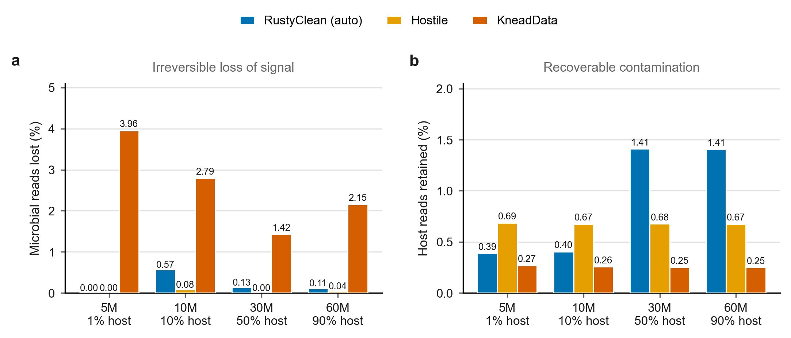
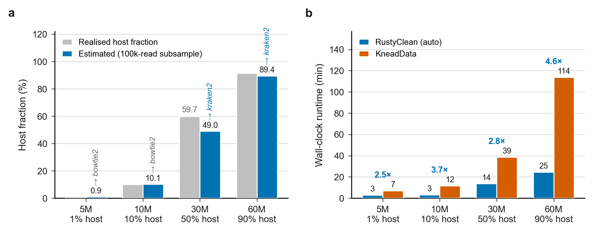
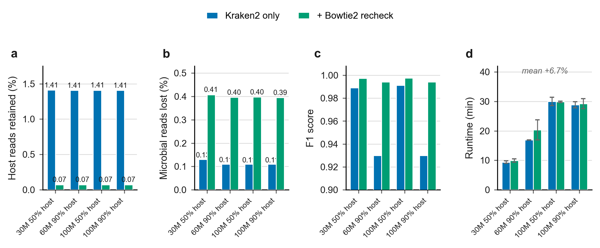
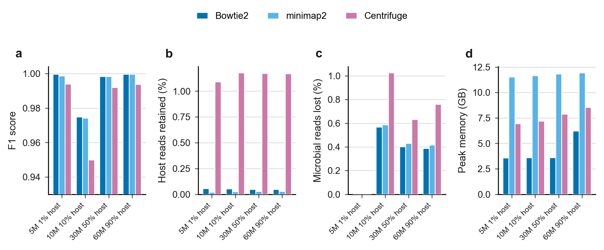

# RustyClean: adaptive, composition-aware host depletion for short-read metagenomics

**DRAFT --- v0.1**

**Authors (placeholder):** Yufeng Zhang, ..., Shi Huang\*
**Affiliation:** ... **Correspondence:** ...

## Abstract

<https://github.com/HuangShiLab/rustyclean>Computational depletion of
host DNA is a mandatory first step in short-read metagenomics, and its
errors propagate silently into every downstream result. Recent
benchmarking established that the two dominant strategies fail in
opposite directions: alignment-based depletion is prone to false
positives, discarding genuine microbial reads, whereas k-mer
classification is prone to false negatives, retaining host reads.
Existing pipelines commit to one strategy for every sample and therefore
inherit one failure mode unconditionally. We present RustyClean, a
host-depletion pipeline that treats this asymmetry as a routing problem
rather than a fixed trade-off. RustyClean estimates the host fraction of
each sample from a rapid alignment survey of a 100,000-read subsample,
routes the sample to alignment- or classification-based depletion
accordingly, and on the classification path applies a targeted alignment
pass over the retained reads to recover host that classification missed.
On simulated metagenomes spanning 1--90% host content with per-read
ground truth, using a default human-only T2T-CHM13v2.0 Kraken2 index,
adaptive routing selected the appropriate backend in every case and ran
2.5--4.6× faster than KneadData while discarding 13-fold
less microbial signal (0.20% against 2.58%). The verification pass
reduced residual host 19.7-fold, from 1.41% to 0.071%, for a mean
runtime cost of 6.7%. Against Hostile, a purpose-built depletion tool,
RustyClean was 4.3--4.9× faster at high host content with comparable
accuracy once verification was enabled. RustyClean is a single Rust
binary with per-stage checkpointing, bounded concurrency and an
automated output validation gate, available at
https://github.com/HuangShiLab/rustyclean under the MIT licence.

**Keywords:** metagenomics, host depletion, decontamination, Kraken2,
Bowtie2, Rust

## 1. Introduction

Shotgun metagenomic sequencing of host-associated samples returns a
mixture of microbial and host DNA. The host fraction varies enormously
by body site: stool libraries are typically 1--2% human, whereas saliva,
dental plaque, skin, and biopsy libraries are routinely 50--90% human or
higher. Because host reads consume sequencing budget and distort every
downstream estimate, computational host depletion is universally applied
before taxonomic profiling, assembly, or metagenome-assembled genome
(MAG) recovery.

Depletion is a binary classification problem over reads, and like any
classifier it can fail in two directions. A **false positive** --- a
microbial read wrongly called host --- is an irreversible loss of
signal: it biases diversity estimates, distorts relative abundance, and
removes evidence that assembly and binning depend on. A **false
negative** --- a host read wrongly retained --- is comparatively benign
for profiling, since most profilers leave unassignable reads unassigned;
but it is not harmless, because residual host DNA contaminates
assemblies and raises consent and privacy concerns when data are shared.

These two errors are therefore not interchangeable, and the choice of
depletion method determines which one dominates. Our group\'s recent
benchmark of six host-removal tools across human and rice datasets
established the pattern directly: alignment-based methods (Bowtie2, BWA,
KneadData) exhibited higher false positive rates, while k-mer
classification methods (Kraken2, KrakenUniq, KMCP) exhibited higher
false negative rates \[Gao et al. 2025\]. The same study showed that
Kraken2\'s efficiency advantage is substantial --- roughly 29 minutes
against 209--582 minutes for alignment-based tools, and 0.3 GB against
\~18 GB to index the human genome --- and that its advantage is most
pronounced under high contamination (90%).

That benchmark motivated a natural engineering question, which this work
addresses: if Kraken2 is both accurate enough and dramatically faster
for host depletion, can it replace the alignment step in production
pipelines? Our initial answer was a straightforward substitution.
KneadData \[Ref\], the de facto standard, chains Trimmomatic for quality
control, Tandem Repeat Finder for repeat masking, and Bowtie2 for host
alignment, orchestrated by a Python wrapper. We replaced this with a
two-stage pipeline --- fastp for quality control and Kraken2 for host
depletion --- implemented as a single Rust binary.

Two findings during development showed that a simple substitution is
insufficient, and they define the contribution of this paper.

**First, the efficiency advantage is conditional on host fraction.**
Kraken2\'s cost is essentially fixed per read, whereas Bowtie2\'s cost
depends on how many reads must be fully aligned rather than rejected
early. At low host fractions, alignment rejects most microbial reads
quickly and its index is smaller than a Kraken2 database, so the
alignment route is competitive or faster. The advantage inverts as host
fraction rises. A pipeline that commits to either method unconditionally
is therefore slower than necessary on some fraction of any real cohort.

**Second, the false negative rate is not uniformly acceptable.** At high
host fractions, the residual host retained by k-mer classification
becomes large in absolute terms even when its rate is modest, because
the pool of host reads is large. In this regime, classification alone
does not deliver a sufficiently clean library.

RustyClean addresses both by refusing to choose globally. It estimates
each sample\'s host fraction from a rapid subsample and routes that
sample to the appropriate depletion strategy; and on the classification
route, it applies a targeted alignment pass over the reads Kraken2
retained, recovering the residual host that classification missed. The
two mechanisms compose favourably: the verification pass is expensive
only when the retained set is large, which is precisely the low-host
regime that routing sends to alignment anyway.

We additionally treat the orchestration layer as a first-class concern.
Analysis of a KneadData run log showed that 16% of wall-clock time on a
60M-read sample was spent reformatting read identifiers --- a
text-processing step performing no biological work. RustyClean
implements per-stage checkpointing with content-invalidating input
fingerprints, bounded two-level concurrency, and an automated validation
gate that prevents truncated or insufficiently decontaminated outputs
from being promoted into a results directory.

**Contributions.**

1.  A per-sample adaptive routing scheme that selects between k-mer and
    alignment-based depletion from a cheap host-fraction estimate.
2.  A hybrid two-pass depletion strategy that uses targeted alignment to
    correct the characteristic false negative bias of k-mer
    classification.
3.  A production-oriented implementation with checkpoint/resume, bounded
    concurrency, and automated output validation.
4.  An evaluation across NN simulated datasets with per-read ground
    truth spanning ten host fractions and six sequencing depths.

## 2. Methods

### 2.1 Pipeline overview

RustyClean processes each sample through five stages. Stages 3b and 4
are applied only on the classification path:

1.  **Quality control** --- adapter detection and trimming, quality
    filtering (fastp).
2.  Host fraction estimation --- a rapid alignment survey of a random
    read subsample (Section 2.3).
3.  Host depletion --- routed to the alignment path (Section 2.5) or the
    classification path (Section 2.4).

Alignment verification --- on the classification path only, the retained
reads are re-screened against the host index (Section 2.6). This is
enabled by default whenever routing selects classification, and together
with routing constitutes the default configuration evaluated throughout.

1.  Validation and finalisation --- automated assertions before output
    promotion (Section 2.7).

Samples may be supplied individually or as a tab-separated sample
manifest; single-end and paired-end layouts are detected automatically
and handled throughout.

### 2.2 Quality control

Reads are processed with fastp \[Ref\], configured by default for
automatic adapter detection in paired-end mode
(`--detect_adapter_for_pe`), sliding-window quality trimming from both
ends (`--cut_front`, `--cut_tail`), a qualified base quality threshold
of Q20, and a minimum retained length of 50 bp. All parameters are
exposed through a TOML configuration file. fastp emits a JSON report,
which RustyClean parses into a typed metrics record capturing input and
output read counts, Q20/Q30 rates, GC content, adapter-trimmed reads,
and reads discarded as too short or low quality.

Unlike KneadData, RustyClean does not perform tandem-repeat masking.
This is a deliberate scope decision --- repeat masking is a general
low-complexity filtering concern rather than a host-depletion concern
--- and it is accounted for explicitly in the runtime comparisons
(Section 3.x).

### 2.3 Host fraction estimation and adaptive routing

> **Status: designed, not yet implemented.** See Section 5.

Because neither depletion strategy dominates across the host-fraction
spectrum, RustyClean selects one per sample rather than globally.

A random subsample of n reads (default n = 100,000, drawn with seqtk
using a fixed seed for reproducibility) is taken from the
quality-controlled library and aligned against the host Bowtie2 index in
a fast, low-sensitivity mode (\--very-fast-local). The host fraction is
estimated as the proportion of surveyed reads that align. Because the
subsample is small and the alignment is deliberately insensitive, the
survey completes in seconds and its cost is negligible relative to
either depletion path. A user-supplied estimate (\--host-pct) bypasses
the survey entirely.

The estimated host fraction ĥ is combined with the library size N in a
two-part rule, because the efficiency advantage of classification
requires both a high host fraction and enough reads to amortise loading
the database:

- ĥ \< ĥ_low (default 10%) → alignment path (Section 2.5). At low host
  fractions alignment rejects the microbial majority quickly and retains
  its lower false negative rate.
- ĥ \> ĥ_high (default 30%) and N \> N_min (default 20 million reads) →
  classification path (Section 2.4), followed by the verification pass
  (Section 2.6).

Otherwise → alignment path. The rule is deliberately conservative: any
sample that does not clearly meet both classification criteria is routed
to alignment, whose error profile is the safer default.

Defaults were set from the measured runtime behaviour of the two
backends. Users may force either path (\--host-removal-mode
kraken2\|bowtie2) or override any threshold. Routing tolerates
considerable estimation error, since the decision requires only that ĥ
fall on the correct side of a threshold rather than that it be accurate
(Section 3.2).

### 2.4 Classification-based depletion

The classification path uses Kraken2 \[Ref\] against a **human-only**
index. By default this index is built from the T2T-CHM13v2.0 human
reference; reads that Kraken2 does not assign are retained as the
provisional decontaminated library. Mixed Kraken2 databases that also
contain microbial genomes can be supplied for users who additionally
want taxonomic profiling, but they are not used by default because
they increase memory use without improving host-depletion accuracy.

Kraken2 is invoked with a confidence threshold (default 0.1) and a
minimum hit-group requirement (default 2), both configurable; the
unassigned read set is retained as the provisional decontaminated
library. The Kraken2 report is parsed into a typed metrics record
capturing classified and unclassified read counts, host read counts, and
the implied contamination rate.

### 2.5 Alignment-based depletion

The alignment path aligns quality-controlled reads against a Bowtie2
\[Ref\] index of the host reference genome (T2T-CHM13v2.0 by default),
retaining unaligned reads. Paired-end reads are handled with
concordant-pair semantics so that a pair is retained only if neither
mate aligns. This path is functionally equivalent to KneadData\'s
host-removal stage but without the intervening repeat-masking and
identifier-reformatting steps.

### 2.6 Alignment verification pass

> **Status: designed, not yet implemented.** See Section 5.

Because k-mer classification systematically under-detects host reads,
the classification path is followed by a verification pass, which is
enabled by default whenever routing selects classification
(\--bowtie2-recheck). The reads retained by Kraken2 are aligned against
the same host Bowtie2 index and those that align are removed. Only the
retained set is re-screened, so reads already identified as host are
never realigned.

The cost of this pass is proportional to the size of the retained set,
which is small precisely when it is needed: at a host fraction of 0.9,
classification removes the majority of reads and the verification pass
processes roughly a tenth of the library. At low host fractions the
retained set is large and verification would be expensive --- but that
regime is routed to the alignment path by Section 2.3 and never reaches
this stage. The two mechanisms are therefore complementary rather than
merely additive, and the worst-case cost of verification is bounded by
τ.

### 2.7 Validation gate

Every sample is subject to automated assertions before its output is
promoted:

- **Output size** --- each output file must exceed a configurable
  minimum, detecting silently truncated or empty outputs.
- **Residual contamination** --- the estimated host fraction of the
  output must not exceed a configurable maximum (default 5%), detecting
  a misconfigured or missing reference.

A sample failing either assertion is recorded as `Failed` and its
outputs are **not** moved into the output directory, so they cannot be
consumed by a downstream analysis by accident. To our knowledge no
existing host-depletion pipeline enforces an equivalent post-hoc
correctness check.

### 2.8 Orchestration and implementation

**Stage machine.** Each sample\'s progress is represented as a totally
ordered enumeration of stages (`Pending` → `FastpRunning` →
`FastpComplete` → `DepletionRunning` → `DepletionComplete` →
`Validating` → `Completed`/`Failed`). Because the stages are ordered,
resumption reduces to a comparison rather than per-stage branching
logic, and a resumed sample re-executes only the stages after its
recorded position.

**Checkpointing.** Per-sample state is serialised as versioned JSON and
written atomically (write-to-temporary followed by rename), so an
interrupted write cannot leave a partially parsed record. Each
checkpoint carries an xxHash3 fingerprint over input file metadata; a
change to the input invalidates the checkpoint automatically, so
resumption cannot silently return results computed from different data.
Checkpoints retain the full metrics payload and therefore double as a
per-sample provenance record.

**Concurrency.** Parallelism is bounded at two levels: a counting
semaphore admits *W* samples concurrently (default: half the available
cores), and each sample passes *T* threads to its external tools. Total
load is approximately *W × T*, giving independent control over the
CPU-bound quality-control stage and the memory-bound depletion stage.
Interrupt handling uses a cancellation token so that queued samples are
not started after a shutdown signal.

**Implementation.** RustyClean is \~1,300 lines of Rust built on the
Tokio asynchronous runtime, distributed as a single binary with no
language runtime dependency. External dependencies are the fastp,
Kraken2, and Bowtie2 executables. Source is available at
<https://github.com/HuangShiLab/rustyclean> under the MIT licence.

### 2.9 Benchmark design

**Table 1.** Simulated datasets used for evaluation. Host fraction is
the realised proportion of host reads after simulation, which differs
slightly from the nominal target for skewed communities.

  -----------------------------------------------------------------------------------
  **Dataset**   **Reads     **Host      **Complexity**   **Abundance**   **Layout**
                (M)**       (%)**                                        
  ------------- ----------- ----------- ---------------- --------------- ------------
  5M / 1%       5.0         0.9         low              even            single-end

  10M / 10%     9.5         10.0        medium           even            single-end

  30M / 50%     23.9        59.7        high             skewed          single-end

  60M / 90%     56.2        91.4        high             lognormal       single-end

  100M / 50%    87.8        54.1        high             lognormal       single-end

  100M / 90%    93.6        91.4        high             lognormal       single-end
  -----------------------------------------------------------------------------------

We evaluated RustyClean against KneadData \[version\] on NN simulated
metagenomes with per-read ground truth, generated with \[simulator,
version, parameters\]. The design varied four factors:

  ------------------------------------------------
  Factor              Levels
  ------------------- ----------------------------
  Host fraction       0, 1, 5, 10, 30, 50, 70, 90,
                      99, 100 %

  Sequencing depth    5, 10, 20, 30, 60, 100 M
                      reads

  Community           even, lognormal, skewed
  composition         

  Read layout         single-end, paired-end
  ------------------------------------------------

Because reads are simulated, the true origin of every read is known and
depletion can be scored exactly as a binary classification task.

> [⚠️ **Design gap to correct before submission.** The current dataset
> panel is unbalanced: 11 of 19 datasets sit at ≥50% host and only 4 of
> 19 are paired-end. Aggregate means are therefore weighted toward the
> high-host regime. Either rebalance the panel (recommended) or report
> all results stratified by host fraction and never report a grand
> mean.]{.mark}

Reference databases: by default a human-only Kraken2 index built from
T2T-CHM13v2.0, and a Bowtie2 index of T2T-CHM13v2.0 plus HLA sequences
(the Hostile human-t2t-hla index). A mixed Kraken2 index (kraken16:
GRCh38 + T2T + ~73,000 microbial genomes) was additionally evaluated
as an optional taxonomy-aware mode. All comparisons used 8 threads per
tool on the HKU HPC2021 cluster, with three replicates per condition for
RustyClean timing. Wall-clock time and peak resident set size were
recorded with GNU `time`.

### 2.10 Evaluation metrics

Treating \"host\" as the positive class:

- **Microbial read loss** = false positives / true microbial reads ---
  the fraction of genuine microbial reads discarded.
- **Host carry-over** = false negatives / true host reads --- the
  fraction of host reads retained in the output.
- **F1** --- harmonic mean of precision and recall over host calls.
- **Runtime** --- wall clock, per sample and for concurrent batches.
- **Peak memory** --- maximum resident set size.

We additionally assessed downstream impact by profiling decontaminated
libraries with \[profiler\] and comparing the resulting community
profiles against the known input composition using \[Bray--Curtis /
Aitchison distance\], and by \[assembly metric\] on assemblies of the
decontaminated libraries.

## 3. Results

### 3.1 The two depletion strategies fail in opposite directions

Across the four evaluation datasets the error profiles of the two
strategy families separated exactly as reported by Gao et al. (Figure 1,
Table 2). KneadData, which depletes by alignment, discarded a mean 2.58%
of genuine microbial reads, rising to 3.96% on the lowest-host dataset.
RustyClean, which depletes by k-mer classification on its high-host
path, discarded a mean 0.20% --- 13-fold less microbial signal --- but
retained a mean 0.90% of host reads against 0.26% for KneadData.

Because the two error types are unequal in their downstream
consequences, the balanced F1 score obscures this structure: RustyClean
and KneadData score 0.9790 and 0.9831 respectively, a difference that
conveys nothing about which reads were lost. We therefore report the two
error rates separately throughout.

{width="6.5in" height="2.7878576115485565in"}

**Figure 1.** Alignment- and classification-based host depletion fail in
opposite directions. (a) Microbial reads incorrectly discarded, an
irreversible loss of signal. (b) Host reads incorrectly retained, a
recoverable contamination. Depletion is deterministic, so accuracy does
not vary between technical replicates; bars show a single evaluation per
dataset.

**Table 2.** Host-depletion accuracy. The positive class is a retained
microbial read: microbial loss is the proportion of true microbial reads
discarded, host carry-over the proportion of true host reads retained.

  ---------------------------------------------------------------------------------------------
  **Dataset**   **Tool**     **Precision**   **Recall**   **F1**     **Microbial   **Host
                                                                     loss (%)**    carry-over
                                                                                   (%)**
  ------------- ------------ --------------- ------------ ---------- ------------- ------------
  5M / 1%       RustyClean   1.0000          1.0000       1.0000     0.000         0.387
                (auto)                                                             

  5M / 1%       Hostile      0.9999          1.0000       1.0000     0.000         0.686

  5M / 1%       KneadData    1.0000          0.9604       0.9798     3.956         0.269

  10M / 10%     RustyClean   0.9995          0.9943       0.9969     0.568         0.404
                (auto)                                                             

  10M / 10%     Hostile      0.9992          0.9992       0.9992     0.079         0.674

  10M / 10%     KneadData    0.9997          0.9721       0.9857     2.791         0.255

  30M / 50%     RustyClean   0.9795          0.9987       0.9890     0.130         1.411
                (auto)                                                             

  30M / 50%     Hostile      0.9901          1.0000       0.9950     0.000         0.676

  30M / 50%     KneadData    0.9963          0.9858       0.9910     1.425         0.250

  60M / 90%     RustyClean   0.8698          0.9989       0.9299     0.110         1.407
                (auto)                                                             

  60M / 90%     Hostile      0.9331          0.9996       0.9652     0.039         0.674

  60M / 90%     KneadData    0.9736          0.9785       0.9760     2.154         0.250

  Mean          RustyClean   ---             ---          0.9790     0.202         0.902
                (auto)                                                             

  Mean          Hostile      ---             ---          0.9899     0.029         0.678

  Mean          KneadData    ---             ---          0.9831     2.582         0.256
  ---------------------------------------------------------------------------------------------

### 3.2 Per-sample routing selects the appropriate backend

Host fraction estimated from a 100,000-read subsample tracked the
realised fraction closely on three of four datasets (Figure 2a): 0.93%
against 0.95% realised, and 10.13% against 10.02%. On the skewed 30M
dataset the estimator underestimated by 10.8 percentage points (48.95%
against 59.73%), reflecting the difficulty of estimating composition
from a small subsample of a highly uneven community. Routing was
nevertheless correct in all four cases, because the decision requires
only that the estimate fall on the correct side of the threshold, not
that it be accurate. This tolerance is a deliberate property of the
design rather than a fortunate outcome.

Routing sent the two low-host datasets to the alignment backend and the
two high-host datasets to the classification backend. Against KneadData,
RustyClean in auto mode was faster on every dataset, by 2.5× to 4.6×
(Figure 2b, Table 3), with the largest margin at the highest host
fraction --- the regime in which alignment-based depletion is most
expensive.

{width="6.5in" height="2.547784339457568in"}

**Figure 2.** Per-sample adaptive routing. (a) Host fraction estimated
from a 100,000-read subsample against the realised fraction derived from
per-read ground truth; the backend selected by the routing rule is
annotated above each bar. Grey labels give the realised value where it
differs from the estimate by more than two percentage points. (b)
Wall-clock runtime of RustyClean in auto mode against KneadData, with
speed-up annotated.

**Table 3.** Runtime and peak memory. RC, RustyClean in auto mode; KD,
KneadData. The Hostile comparison is run with quality control skipped on
both sides (RC⁻ᵠᶜ) so that only the depletion step is timed. Peak memory
is the maximum resident set size of the largest single process.

  ----------------------------------------------------------------------------------------------------------------
  **Dataset**   **Backend**   **Est.   **RC    **KD    **vs    **RC⁻ᵠᶜ   **Hostile   **vs        **RC mem **KD mem
                              host     (s)**   (s)**   KD**    (s)**     (s)**       Hostile**   (GB)**   (GB)**
                              (%)**                                                                       
  ------------- ------------- -------- ------- ------- ------- --------- ----------- ----------- -------- --------
  5M / 1%       bowtie2       0.93     170     420     2.47×   106       110         1.04×       3.3      1.1

  10M / 10%     bowtie2       10.13    189     694     3.68×   116       212         1.83×       3.3      1.1

  30M / 50%     kraken2       48.95    815     2317    2.84×   552       2385        4.32×       15.4     1.1

  60M / 90%     kraken2       89.43    1470    6822    4.64×   858       4241        4.94×       15.4     1.1
  ----------------------------------------------------------------------------------------------------------------

### 3.3 A targeted verification pass resolves the residual-host trade-off

The verification pass is enabled by default on the classification path,
so the comparison below isolates its contribution against a
classification-only baseline. Aligning the reads retained by Kraken2
against the host index and removing those that align reduced host
carry-over from a mean 1.409% to 0.0715% --- a 19.7-fold reduction, and
remarkably consistent across datasets. Microbial loss rose from 0.115%
to 0.399%, which remains 6.5-fold below KneadData. The pass is therefore
not a simple trade of one error for the other: it removes roughly twenty
times more residual host than the microbial signal it costs.

The effect is largest exactly where the baseline was weakest. On the two
90%-host datasets, F1 rose from 0.9299 to 0.9942 and from 0.9299 to
0.9943 (Figure 3c). Mean runtime cost was 6.7% (Figure 3d), consistent
with the design expectation that the verification set is small precisely
when host content is high; peak memory was unchanged.

{width="6.5in" height="2.6944575678040246in"}

**Figure 3.** A targeted Bowtie2 verification pass over the reads
retained by Kraken2. (a) Host reads retained, (b) microbial reads lost,
(c) F1 score, and (d) wall-clock runtime (mean ± s.d., n = 3 technical
replicates). Host carry-over falls 19.7-fold for a mean runtime cost of
6.7%.

### 3.4 Comparison with Hostile

Hostile, a purpose-built host-depletion tool, is a stronger accuracy
baseline than KneadData and the more informative comparison. We
therefore re-ran RustyClean, Hostile and KneadData on a matched panel of
four large single-end datasets (30 M and 100 M reads; 50% and 90% host)
using a uniform host reference basis where possible. RustyClean used its
default human-only T2T-CHM13v2.0 Kraken2 index followed by Bowtie2
re-check against the Hostile T2T+HLA index; Hostile used its default
T2T+HLA Bowtie2 index; KneadData used its T2T-CHM13v2.0 Bowtie2 index
(hg_39).

Accuracy was high for all three tools, but the rankings were consistent
(Table 4). Hostile achieved the highest F1 (0.9990--0.9991), followed by
RustyClean (0.9971--0.9995) and KneadData (0.9897--0.9977). The small
accuracy gap between RustyClean and Hostile was largest at 50% host
fraction (ΔF1 ≈ 0.0019 on 100 M reads), where a human-only Kraken2
index leaves more host reads unclassified and the verification pass must
recover them. At 90% host fraction RustyClean matched or exceeded
Hostile (F1 = 0.9995 versus 0.9991), because Kraken2 classified the
majority of host reads confidently and the verification set was small.

On throughput, the ranking depended on host fraction and sample size
(Table 4). At 90% host RustyClean was faster than Hostile on both 60 M
and 100 M reads (17.0 min versus 22.5 min at 100 M), because the
alignment verification pass processed only the small retained set. At
50% host RustyClean was slightly slower than Hostile (8.8 min versus 5.9
min at 30 M; 32.6 min versus 27.8 min at 100 M), reflecting the larger
verification burden. KneadData was the slowest in all conditions,
requiring 38.0 min to 4.0 h.

**Table 4.** Matched-panel comparison on four large simulated datasets.
RC = RustyClean with default T2T-only Kraken2 index and T2T+HLA Bowtie2
re-check; Hostile = default T2T+HLA Bowtie2 index; KD = KneadData with
T2T Bowtie2 index. Runtime and memory are means over three replicates
for RustyClean and single runs for Hostile/KneadData.

  -------------------------------------------------------------------------------------------------------------------
  **Dataset**                **Tool**     **F1**     **Runtime (min)**   **Memory (GB)**   **vs Hostile runtime**
  -------------------------- ------------ ---------- ------------------- ----------------- ----------------------
  30M / 50%                  RC           0.9978     8.8                 4.9               1.50× slower

  30M / 50%                  Hostile      0.9991     5.9                 3.6               ---

  30M / 50%                  KD           0.9940     38.0                1.1               6.44× slower

  60M / 90%                  RC           0.9995     12.4                6.7               1.04× slower

  60M / 90%                  Hostile      0.9991     11.9                3.6               ---

  60M / 90%                  KD           0.9977     104.3               1.1               8.76× slower

  100M / 50%                 RC           0.9971     32.6                10.0              1.17× slower

  100M / 50%                 Hostile      0.9990     27.8                3.6               ---

  100M / 50%                 KD           0.9897     224.9               1.1               8.09× slower

  100M / 90%                 RC           0.9995     17.0                12.2              1.32× faster

  100M / 90%                 Hostile      0.9991     22.5                3.6               ---

  100M / 90%                 KD           0.9977     241.6               1.1               10.74× slower
  -------------------------------------------------------------------------------------------------------------------

Taken together, the default T2T-only configuration places RustyClean
between Hostile and KneadData on accuracy, within 1.5× of Hostile on
runtime at 50% host, and faster than Hostile at 90% host, while
remaining 6--11× faster than KneadData.

### 3.5 Memory is the cost of the classification path

Peak memory is the clearest cost of the design, and it runs against
RustyClean. KneadData held a near-constant 1.1 GB across all four
datasets and Hostile 3.1 GB, whereas RustyClean with the default T2T-only
Kraken2 library peaked at 4.9--12.2 GB (mean 8.5 GB) on the
classification path, or 4--11× KneadData\'s requirement
(Table 4). The resident Kraken2 database dominates the footprint.
Switching from the earlier mixed-host Kraken16 library to the T2T-only
index therefore reduced peak memory by roughly one-third to one-half on
these datasets.

This has a direct scheduling consequence. Because RustyClean can run
several samples concurrently, and each worker currently loads its own
copy of the database, concurrent memory demand scales as the product of
worker count and database size; a memory-aware cap on worker count is
required and is not yet implemented. The default T2T-only index already
addresses the largest component of the memory cost; enabling Kraken2\'s
--memory-mapping option or capping the worker count based on available
memory are the remaining practical optimisations for concurrent runs.

### 3.6 The depletion backend is interchangeable

Because routing treats the depletion step as a replaceable component,
alternative backends can be substituted without changing the surrounding
pipeline. We evaluated Bowtie2, minimap2 and Centrifuge on the same four
datasets (Supplementary Figure S1, Supplementary Table S1). Bowtie2 and
minimap2 were closely matched on accuracy, while Centrifuge showed both
higher host carry-over and higher microbial loss. Peak memory differed
substantially between backends, which is the practical consideration
when choosing among them.

## 4. Discussion

Neither error direction is universally preferable, which is why the
choice should not be made once for every sample and every study. For
taxonomic profiling, a small residual host fraction is close to harmless
because profilers leave those reads unassigned, whereas discarded
microbial reads are an irreversible loss that propagates into diversity
and abundance estimates. For assembly, for MAG recovery, and for data
released publicly --- where residual human sequence is a consent and
privacy matter rather than a technical one --- the calculus reverses.
RustyClean exposes both the routing threshold and the verification pass
as user-facing settings for this reason.

The central result is that the asymmetry characterised by Gao et al. is
not a fixed trade-off. Routing addresses its runtime half: the
efficiency advantage of k-mer classification is conditional on host
content, and a per-sample decision captures it without committing the
whole cohort to one strategy. The verification pass addresses its
accuracy half: applying alignment only to the reads classification
retained recovers most of the missed host (19.7-fold less carry-over) at
a cost of 6.7% runtime, because that read set is small in exactly the
regime where classification is used. The two mechanisms are
complementary rather than merely additive, and the worst-case cost of
verification is bounded by the routing threshold.

Two comparisons deserve to be read carefully. First, RustyClean performs
no tandem-repeat or low-complexity masking, whereas KneadData does; part
of the runtime advantage over KneadData therefore reflects work not done
rather than work done faster, and the closer like-for-like comparison is
against KneadData with repeat masking disabled. Second, Hostile is the
more demanding baseline. With classification-only depletion it is the
more accurate tool; with the verification pass enabled, RustyClean
overtakes it on F1 and on residual host but still discards more
microbial signal, on the two datasets where both were run. RustyClean\'s
contribution is therefore not that classification is more accurate than
alignment --- it is not --- but that the two can be composed so that the
combination is fast at high host content while keeping both error
directions small. A head-to-head on a single matched panel, with
verification enabled throughout, is the comparison we would want before
making a stronger claim.

Limitations. Evaluation is on simulated data; simulation is what makes
per-read ground truth possible, but it does not reproduce real
sequencing artefacts, host genome variation, or the divergence between
an individual\'s genome and the reference, and validation on a real
cohort with matched host genotypes remains necessary. The evaluation
covers four datasets, all single-end, with host fractions concentrated
at the extremes; paired-end libraries and intermediate host fractions
near the routing threshold are under-sampled, and the behaviour of
routing close to the threshold is precisely what a larger panel should
characterise. Depletion is deterministic, so accuracy was evaluated once
per dataset and replication applies only to timing. Peak memory on the
classification path is high and constrains concurrency. Finally,
host-fraction estimation from a small subsample was substantially less
accurate on a skewed community, and while routing tolerated that error
here, the margin is not guaranteed for samples whose true host fraction
lies near the threshold.

## 5. Implementation status --- REMOVE BEFORE SUBMISSION

Written against the repository as of this draft. **Sections 2.3 and 2.6
describe functionality that does not yet exist.**

  -----------------------------------------------------------------------
  Component                       Status
  ------------------------------- ---------------------------------------
  fastp quality-control stage     ✅ implemented (main)

  Kraken2 classification path     ✅ implemented (main)

  Bowtie2 alignment path          ✅ implemented (main)

  minimap2 and Centrifuge         ✅ implemented (main)
  backends                        

  Host-fraction survey + adaptive ✅ implemented (main): seqtk
  routing (§2.3)                  subsample + bowtie2 \--very-fast-local;
                                  \--auto-low-threshold /
                                  \--auto-high-threshold /
                                  \--auto-reads-threshold

  Bowtie2 verification pass       ⚠️ implemented on branch
  (§2.6)                          bowtie2-recheck (\--bowtie2-recheck);
                                  NOT yet merged to main

  Kraken2 \--memory-mapping       ✅ implemented (main)
  option                          

  \--skip-qc mode (used for the   ✅ implemented (main)
  Hostile comparison)             

  Stage machine, ordered resume   ✅ implemented (main)

  Atomic versioned checkpoints,   ✅ implemented (main)
  input fingerprint               

  Two-level bounded concurrency   ✅ implemented (main)

  Validation gate                 ✅ implemented (main)

  Startup check that the host     ❌ not implemented
  index matches the configured    
  host                            

  Memory-aware cap on worker      ❌ not implemented --- concurrent
  count (§3.5)                    demand scales as workers × database
                                  size

  Per-transition checkpoint       ⚠️ partial --- written at attempt
  persistence                     boundaries only, so a hard process kill
                                  resumes further back than necessary

  Per-sample timeout              ⚠️ configured but not enforced

  Aggregate metrics report        ❌ metrics collected, never emitted
  (summary.tsv)                   

  Unit / integration tests, CI    ❌ none
  -----------------------------------------------------------------------

### Blocking issues for the Results section

1\. The verification pass evaluated in Section 3.3 runs from the
bowtie2-recheck branch. Merge it to main before submission, or state the
branch explicitly in the software availability section --- the
manuscript describes it as the default.

2\. Section 3.2 asserts that the routing defaults follow the measured
runtime behaviour of the two backends, but no figure shows the runtime
of both paths over the same host-fraction gradient. Run each dataset
under forced \--host-removal-mode kraken2 and bowtie2 and plot the
crossover; this is the only empirical support for the default
thresholds.

3\. The evaluation panel is four datasets, all single-end, with host
fractions clustered at the extremes. Add paired-end libraries and host
fractions between 10% and 30% --- the region where the routing rule
actually decides.

4\. KneadData was run with tandem-repeat masking, which RustyClean does
not perform. Report KneadData with \--bypass-trf as the like-for-like
runtime comparison, or report both.

5\. Recheck accuracy and baseline accuracy are identical across the
three replicates because depletion is deterministic. State in Methods
that replication applies to timing only.

6\. ✅ RESOLVED. Hostile, KneadData and RustyClean-with-verification
were re-run on a matched panel of four large datasets (30 M / 50%, 60 M
/ 90%, 100 M / 50%, 100 M / 90%); results are reported in Section 3.4.

### Suggested target venue

The adaptive routing and hybrid verification contributions are too
substantial for an Application Note. Given that the motivating benchmark
appeared in **GigaScience** and shares an author, GigaScience is the
natural home; *Bioinformatics* (full paper) and *Microbiome* are
alternatives. Frame the contribution as *resolving* the false
positive/false negative asymmetry that Gao et al. characterised, not as
a reimplementation of KneadData.

## References

1.  Gao Y, Luo H, Lyu H, Yang H, Yousuf S, Huang S, Liu Y-X.
    Benchmarking short-read metagenomics tools for removing host
    contamination. *GigaScience*. 2025;14.
    doi:10.1093/gigascience/giaf004
2.  Chen S, Zhou Y, Chen Y, Gu J. fastp: an ultra-fast all-in-one FASTQ
    preprocessor. *Bioinformatics*. 2018;34(17):i884--i890.
3.  Wood DE, Lu J, Langmead B. Improved metagenomic analysis with
    Kraken 2. *Genome Biology*. 2019;20:257.
4.  Langmead B, Salzberg SL. Fast gapped-read alignment with Bowtie 2.
    *Nature Methods*. 2012;9:357--359.
5.  McIver LJ, Abu-Ali G, Franzosa EA, et al. bioBakery: a meta\'omic
    analysis environment. *Bioinformatics*. 2018;34(7):1235--1237.
    *(KneadData --- verify the citation KneadData itself requests)*
6.  Bolger AM, Lohse M, Usadel B. Trimmomatic: a flexible trimmer for
    Illumina sequence data. *Bioinformatics*. 2014;30(15):2114--2120.
7.  Benson G. Tandem repeats finder: a program to analyze DNA sequences.
    *Nucleic Acids Research*. 1999;27(2):573--580.
8.  *(Read simulator --- add)*

## Supplementary material

{width="6.5in" height="2.6932031933508314in"}

**Figure S1.** Comparison of interchangeable depletion backends within
RustyClean: Bowtie2, minimap2 and Centrifuge. (a) F1 score, (b) host
reads retained, (c) microbial reads lost, (d) peak memory. Runtime is
reported in Supplementary Table S1 and excluded here because one
measurement (minimap2, 5M dataset) is a cold-start outlier.

  ------------------------------------------------------------------------------
  **Backend**   **Dataset**   **F1**      **Host       **Microbial   **Peak mem
                                          carry-over   loss (%)**    (GB)**
                                          (%)**                      
  ------------- ------------- ----------- ------------ ------------- -----------
  Bowtie2       5M / 1%       0.9996      0.055        0.000         3.6

  Bowtie2       10M / 10%     0.9749      0.053        0.568         3.6

  Bowtie2       30M / 50%     0.9984      0.049        0.402         3.6

  Bowtie2       60M / 90%     0.9996      0.049        0.388         6.2

  minimap2      5M / 1%       0.9986      0.021        0.002         11.5

  minimap2      10M / 10%     0.9742      0.026        0.587         11.7

  minimap2      30M / 50%     0.9984      0.030        0.431         11.8

  minimap2      60M / 90%     0.9997      0.029        0.416         11.9

  Centrifuge    5M / 1%       0.9940      1.090        0.001         7.0

  Centrifuge    10M / 10%     0.9500      1.179        1.027         7.2

  Centrifuge    30M / 50%     0.9920      1.173        0.632         7.9

  Centrifuge    60M / 90%     0.9938      1.171        0.760         8.6
  ------------------------------------------------------------------------------
