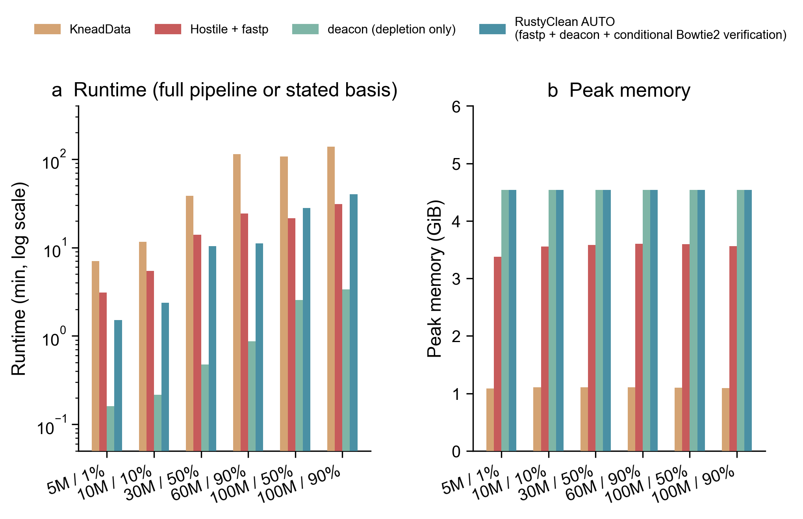

APPLICATION NOTE

**Yufeng Zhang^1^ and Shi Huang^1,\*^**

^1^Faculty of Dentistry, The University of Hong Kong, Hong Kong SAR, China  
^\*^Correspondence: qdu_zyf@163.com

## Abstract

**Summary:** Host-read depletion must retain microbial signal while removing abundant host DNA. RustyClean is a Rust workflow that combines fastp quality control, Deacon minimizer-based depletion and conditional Bowtie2 verification. Verification is triggered only when Deacon reports a removed fraction above a configurable threshold. On six simulated metagenomes spanning 1–90% host, RustyClean AUTO was 3.45–10.19-fold faster than KneadData and 1.29–2.30-fold faster than fastp+Hostile. On high-host libraries, it achieved F1 ≥0.998, 0.0000% host carry-over and ≤0.31% microbial loss.

**Availability and implementation:** RustyClean is implemented in Rust, uses fastp, Deacon, Bowtie2 and samtools, and is available under the MIT licence at https://github.com/HuangShiLab/rustyclean. Benchmark source data are available at https://github.com/HuangShiLab/rustyclean-paper.

**Supplementary information:** Full benchmark tables and figure-generation code are available in the project repository. A detailed benchmark manuscript is available as a separate bioRxiv-ready submission.

**Contact:** qdu_zyf@163.com

## 1 Introduction

Short-read metagenomes from host-associated sites often contain abundant host DNA. Alignment-based depletion is sensitive but can remove genuine microbial reads, whereas rapid classifier- or minimizer-based filters are faster but may retain host reads (Gao et al., 2025). Deacon is a minimizer-based sequence filter with near-alignment accuracy and host-fraction-independent speed (Constantinides et al., 2025). However, it is a depletion primitive rather than a complete cohort workflow. RustyClean addresses this gap by adding quality control, adaptive verification, checkpointing, memory-aware concurrency and output validation.

## 2 Features and implementation

RustyClean AUTO processes each sample in four ordered stages. fastp first performs paired-end adapter detection and quality trimming (Chen et al., 2018). Deacon v0.17.0 then depletes host reads against a compact pangenome index. RustyClean parses the Deacon summary and passes the retained reads to Bowtie2 only when the reported removed fraction is at least 0.30; below this threshold, the Deacon output is accepted without a second alignment pass (Langmead and Salzberg, 2012). Finally, automated checks reject truncated outputs or samples exceeding a configurable residual-host limit.

The workflow is implemented as a single Rust binary and provides sample manifests, atomic checkpoints, content-invalidating input fingerprints, bounded sample-level concurrency and memory-aware worker capping. Each worker maps the same read-only Deacon index, so additional workers add little index memory. The streamlined interface intentionally exposes the production AUTO pipeline and a Deacon-only benchmarking mode rather than multiple deprecated depletion backends.

## 3 Results

On six simulated single-end metagenomes generated with InSilicoSeq and scored with per-read ground truth, RustyClean AUTO required 90.4–2396.7 s across 5–100 million reads (Gourlé et al., 2019). This was 3.45–10.19-fold faster than KneadData v0.12.3 and 1.29–2.30-fold faster than fastp+Hostile (Constantinides et al., 2023; McIver et al., 2018). Deacon depletion alone took 9.6–202.4 s and was 40.9–130.2-fold faster than the complete KneadData pipeline. Peak memory was 4.54 GiB and was bounded by the pangenome index rather than sample size (Fig. 1).

On four high-host datasets (50–90%), Bowtie2 verification reduced host carry-over to 0.0000% of retained output, whereas fastp+Hostile retained 0.17–0.68% and KneadData retained 0.25% (Table 1). RustyClean AUTO maintained F1 ≥0.998 and lost at most 0.31% of microbial reads. Verification therefore provides a practical route to zero measured host carry-over without applying an alignment pass to every low-host sample.

{width=90%}

**Table 1.** Accuracy on four high-host simulated datasets.

| Workflow | F1 range | Microbial loss (%) | Host carry-over (%) |
|---|---:|---:|---:|
| KneadData | 0.97603–0.99098 | 1.425–2.154 | 0.2493–0.2500 |
| fastp+Hostile | 0.96522–0.99878 | 0.000–0.039 | 0.1734–0.6758 |
| Deacon only | 0.99920–0.99997 | 0.000–0.121 | 0.0035–0.0037 |
| RustyClean AUTO | 0.99845–1.00000 | 0.000–0.310 | 0.0000 |

## 4 Conclusion

RustyClean turns rapid minimizer depletion into a reproducible host-depletion workflow. Conditional Bowtie2 verification preserves the speed advantage of Deacon while removing residual host signal precisely in the high-host samples where it matters most.

## Availability and implementation

RustyClean is available under the MIT licence at https://github.com/HuangShiLab/rustyclean. The benchmarked research source is archived at commit `7ab1a4b`; the streamlined AUTO interface is at commit `55f93af`. Figure source data and analysis code are available at https://github.com/HuangShiLab/rustyclean-paper.

## Acknowledgements

The authors thank colleagues at The University of Hong Kong for discussions and computational support.

## References

Chen S. *et al.* (2018) fastp: an ultra-fast all-in-one FASTQ preprocessor. *Bioinformatics*, 34, i884–i890.

Constantinides B. *et al.* (2023) Hostile: accurate decontamination of microbial host sequences. *Bioinformatics*, 39, btad728.

Constantinides B. *et al.* (2025) Deacon: fast sequence filtering and contaminant depletion. *bioRxiv*, 2025.06.09.658732.

Gao Y. *et al.* (2025) Benchmarking short-read metagenomics tools for removing host contamination. *GigaScience*, 14, giaf004.

Gourlé H. *et al.* (2019) Simulating Illumina metagenomic data with InSilicoSeq. *Bioinformatics*, 35, 521–522.

Langmead B. and Salzberg S.L. (2012) Fast gapped-read alignment with Bowtie 2. *Nature Methods*, 9, 357–359.

McIver L.J. *et al.* (2018) bioBakery: a meta’omic analysis environment. *Bioinformatics*, 34, 1235–1237.
