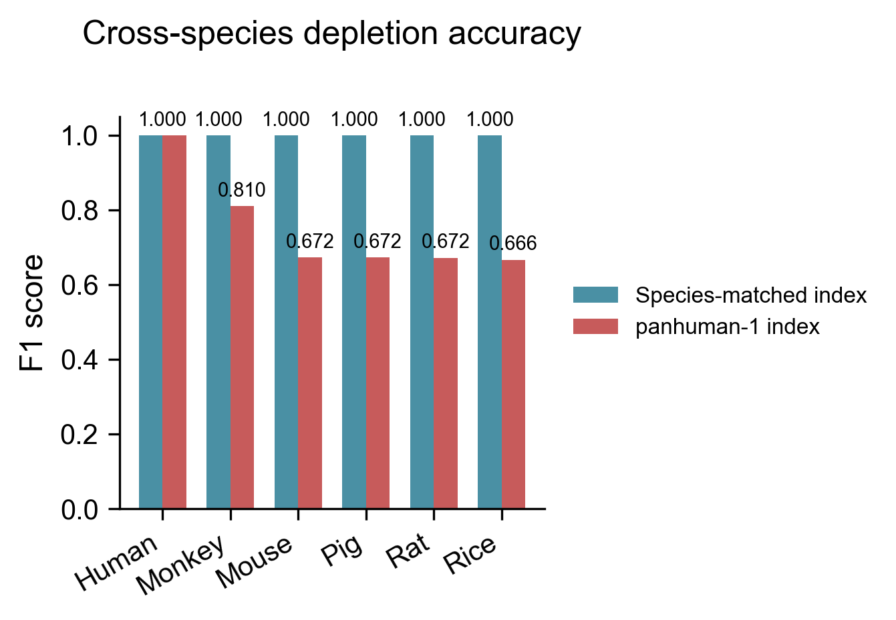
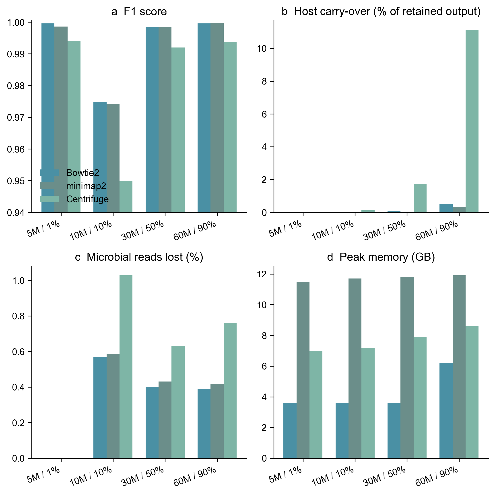

**Yufeng Zhang^1^ and Shi Huang^1,\*^**

^1^Faculty of Dentistry, The University of Hong Kong, Hong Kong SAR, China  
^\*^Correspondence: qdu_zyf@163.com

Running title: Adaptive host-read depletion  
Keywords: metagenomics; host DNA depletion; minimizers; Bowtie2; workflow orchestration; Rust

## Abstract

**Motivation:** Host depletion must balance loss of microbial signal against retention of host DNA. Rapid depletion filters are efficient but require quality control, verification and scalable orchestration.

**Results:** RustyClean combines fastp, Deacon minimizer depletion and conditional Bowtie2 verification. Across six simulated metagenomes, RustyClean AUTO was 3.45–10.19-fold faster than KneadData and 1.29–2.30-fold faster than fastp+Hostile. On high-host libraries, it achieved ≥0.998 F1, 0.0000% host carry-over and ≤0.31% microbial loss. Species-matched Deacon indexes gave F1 ≥0.99986, whereas a human index removed 46.8–99.8% of non-human microbial reads. Eight-worker processing scaled 7.84-fold at near-constant per-worker memory.

**Availability and implementation:** RustyClean is Rust software available under the MIT licence at https://github.com/HuangShiLab/rustyclean, with source data and analysis code at https://github.com/HuangShiLab/rustyclean-paper.

**Supplementary information:** Supplementary Figure S1 and Table S1 accompany this article.

## 1 Introduction

Shotgun metagenomic sequencing of host-associated samples returns a mixture of microbial and host DNA. The host fraction varies widely among body sites: faecal samples are often only a few per cent human, whereas oral, skin and biopsy samples may exceed 50–90% host. Because residual host reads waste sequencing capacity and can distort profiling, assembly and metagenome-assembled genome recovery, computational depletion is generally applied before downstream analysis. The task can be viewed as binary classification at read level. A microbial read incorrectly classified as host is an irreversible false positive that removes biological signal; a host read incorrectly retained is a false negative that contaminates downstream analyses and has privacy implications when human sequence data are shared.

Existing tools make this trade-off in different ways. Alignment-based methods such as Bowtie2 (Langmead and Salzberg, 2012), BWA and KneadData (McIver et al., 2018) remove reads that align to a host reference, whereas k-mer classifiers such as Kraken2 (Wood et al., 2019) use database-backed assignments. In a broad benchmark across human and rice datasets, alignment-based methods tended to discard more microbial reads, whereas classifier-based methods retained more host reads; classification was substantially faster under high contamination (Gao et al., 2025). Hostile (Constantinides et al., 2023) improved the practical alignment trade-off by combining fast streaming with carefully constructed indexes, but its runtime still scales with the amount of sequence that must be aligned.

Deacon, a recently described minimizer-based sequence filter, uses a compact pangenome index and was reported to combine alignment-like accuracy with classification-like speed (Constantinides et al., 2025). Its per-read cost is approximately independent of host fraction. This property changes the design space: rather than routing samples between a fast classifier and a slower, more precise aligner, one fast depletion backend can be used across host fractions, and the remaining question is when a second verification pass is worth its cost. Deacon alone, however, is a sequence filter rather than a production pipeline. It does not perform read-quality control, orchestrate cohorts, checkpoint interrupted samples, validate final outputs or decide when residual host contamination warrants additional screening. Its published indexes also cover only human and mouse, leaving index construction and cross-species validation to users.

RustyClean addresses these gaps by integrating Deacon into a reproducible pipeline and adding conditional verification. RustyClean first applies fastp (Chen et al., 2018), then Deacon, and then Bowtie2 only when Deacon reports that at least a user-configurable fraction of input reads was removed (default 0.30). Thus, low-host samples avoid an unnecessary alignment pass, whereas high-host samples receive a second screen over a relatively small retained set. We evaluated this design on simulated metagenomes with per-read ground truth, compared the full pipeline with KneadData and Hostile, validated species-matched indexes for six host organisms, measured cohort-level parallel scaling and tested robustness on a small human oral microbiome cohort.

## 2 Materials and methods

### 2.1 Pipeline overview

RustyClean AUTO processes each sample through four stages: (i) quality control with fastp; (ii) minimizer-based depletion with Deacon against a user-supplied pangenome index; (iii) conditional Bowtie2 verification; and (iv) validation and finalisation. Single-end and paired-end FASTQ inputs are detected automatically. Samples may be supplied individually or as a manifest. The streamlined production interface exposes only the AUTO pipeline and a `--deacon-only` benchmarking mode; alternative backends used in earlier experiments are not part of the default workflow.

### 2.2 Quality control

Reads are processed with fastp (Chen et al., 2018) using automatic paired-end adapter detection, sliding-window trimming at both ends, a minimum base quality of Q20 and a minimum retained length of 50 bp. fastp reports are parsed into structured per-sample metrics containing input and output read counts, Q20/Q30 rates, GC content, adapter-trimmed reads and length- or quality-filtered reads. RustyClean does not perform tandem-repeat masking, which is supported by KneadData through Trimmomatic (Bolger et al., 2014) and Tandem Repeats Finder (Benson, 1999). This scope difference is retained in the interpretation of runtime comparisons.

### 2.3 Depletion and adaptive verification

Deacon v0.17.0 was used with a k31,w15 pangenome index and clean parameters `-d -a 2 -r 0.01`. For human samples, the default Tier-1 index was the published panhuman-1 pangenome index. RustyClean parses the Deacon summary and obtains the removed-read proportion, `seqs_removed_proportion`. If this value is at least the recheck threshold (default 0.30), the retained reads are screened with Bowtie2 (Langmead and Salzberg, 2012) against the human T2T-CHM13v2.0 plus HLA index used by Hostile; aligned reads are removed. Otherwise, the Deacon output is accepted without realignment. Only the retained set is presented to Bowtie2, and the pass can be disabled with `--no-bowtie2-recheck`.

Before promotion to the final output directory, each sample must pass two assertions: output FASTQ files must exceed a configurable minimum size, and the estimated residual host fraction must not exceed a configurable maximum (default 5%). Failed samples remain visibly failed and are not consumed by downstream steps.

### 2.4 Orchestration

Each sample is represented by an ordered state machine and an atomically written versioned checkpoint. The checkpoint contains an xxHash3 fingerprint of input metadata; changing an input invalidates prior state. Samples can therefore resume after interruption without silently mixing results from different files. Concurrency is controlled at two levels: a counting semaphore admits *W* samples concurrently and each sample passes *T* threads to external tools. If worker count is not set, RustyClean estimates the resident index size and available memory, including cgroup limits, and caps *W* so that concurrent workers remain within approximately 80% of available RAM. RustyClean is a single Rust binary that calls fastp, Deacon, Bowtie2 and samtools.

### 2.5 Benchmark panel

Six single-end simulated metagenomes were generated with InSilicoSeq v2.0.0 (Gourlé et al., 2019) and per-read ground truth. The panel varied realized host fraction (0.9–91.4%), depth (5–100 million nominal reads), community complexity and abundance distribution (Table 1). RustyClean AUTO and standalone Deacon were compared with the full KneadData v0.12.3 pipeline and fastp plus Hostile. KneadData used its hg39_T2T Bowtie2 index (GCF_009914755.1, without HLA); Hostile used human-t2t-hla; RustyClean used panhuman-1 for Tier-1 depletion and the human-t2t-hla Bowtie2 index for verification. KneadData and Hostile+fastp were run with eight threads. Deacon and RustyClean were run with 16 threads. RustyClean timings used three replicates per condition; the AUTO 100M/90% estimate was the mean of two uncached replicates. KneadData and Hostile 100M comparator runs were single measurements because of cost. Wall-clock time and maximum resident set size were recorded with GNU time. Depletion is deterministic, so accuracy was evaluated once per condition.

**Table 1.** Simulated datasets used for the main comparison.

| Dataset | Reads (M) | Host (%) | Complexity | Abundance | Layout |
|---|---:|---:|---|---|---|
| 5M / 1% | 5.0 | 0.9 | low | even | single-end |
| 10M / 10% | 9.5 | 10.0 | medium | even | single-end |
| 30M / 50% | 23.9 | 59.7 | high | skewed | single-end |
| 60M / 90% | 56.2 | 91.4 | high | lognormal | single-end |
| 100M / 50% | 87.8 | 54.1 | high | lognormal | single-end |
| 100M / 90% | 93.6 | 91.4 | high | lognormal | single-end |

### 2.6 Accuracy and performance metrics

Treating host as the positive class, microbial read loss was the number of true microbial reads removed divided by all true microbial reads. Host carry-over was the number of host reads retained divided by the total retained output and is reported as a percentage. F1 was the harmonic mean of precision and recall for host calls. Runtime was sample-level wall time for individual libraries or cohort wall time for parallel batches. Peak memory was maximum resident set size and is reported in GiB unless stated otherwise.

### 2.7 Cross-species and parallel-scaling experiments

Species-specific Deacon indexes (k31,w15) were built for human T2T-CHM13v2.0, monkey, mouse, pig, rat and rice. Index build time and size were recorded. Ten-million-read, 50%-host simulated datasets for each species were depleted with either the matched index or panhuman-1. To assess cohort scaling, sixteen identical 10M-read single-end libraries (10% host) were processed as a manifest with four threads per sample and *W*=1, 2, 4 or 8 concurrent workers on one 64-core AMD node. Because this condition was below the verification threshold, each sample ran fastp and Deacon but not Bowtie2. Deacon processes were sampled every 5 s to record resident set size.

### 2.8 Supplementary backend comparison

To place the default backend in context, we previously compared Bowtie2, minimap2 and Centrifuge within an earlier research build of RustyClean on four simulated datasets. Those experiments used the same orchestration concept but are not exposed by the streamlined production CLI. Results are shown in Supplementary Figure S1 and Table S1 and are retained as provenance rather than as a recommendation.

## 3 Results

### 3.1 Runtime, memory and read-level accuracy

Because Deacon’s cost is approximately independent of host fraction, RustyClean AUTO used the same depletion backend for all six datasets; only verification varied. The complete AUTO pipeline was 3.45–10.19-fold faster than KneadData and 1.29–2.30-fold faster than fastp plus Hostile (Fig. 1, Table 2). Standalone Deacon depletion, which excludes fastp and verification, required only 9.6–202.4 s and was 40.9–130.2-fold faster than the complete KneadData pipeline.

{width=100%}

**Table 2.** Four-tool comparison on the simulated panel. Accuracy is deterministic and was evaluated once per dataset. Runtime and memory for RustyClean/Deacon are means of timing replicates; 100M KneadData and Hostile+fastp runs are single measurements. Host carry-over is host reads as a percentage of retained output.

| Dataset | Tool | Runtime (s) | Memory (GiB) | F1 | Microbial loss (%) | Host carry-over (%) |
|---|---|---:|---:|---:|---:|---:|
| 5M / 1% | KneadData | 420.3 | 1.09 | 0.97981 | 3.956 | 0.2688 |
| 5M / 1% | Hostile+fastp | 186.6 | 3.38 | 0.99997 | 0.000 | 0.6858 |
| 5M / 1% | Deacon only | 9.6 | 4.54 | 1.00000 | 0.000 | 0.0042 |
| 5M / 1% | RustyClean AUTO | 90.4 | 4.54 | 1.00000 | 0.000 | 0.0042 |
| 10M / 10% | KneadData | 694.5 | 1.11 | 0.98571 | 2.791 | 0.2555 |
| 10M / 10% | Hostile+fastp | 326.5 | 3.55 | 0.99923 | 0.079 | 0.6745 |
| 10M / 10% | Deacon only | 13.0 | 4.54 | 0.99881 | 0.238 | 0.0037 |
| 10M / 10% | RustyClean AUTO | 142.0 | 4.54 | 0.99881 | 0.238 | 0.0037 |
| 30M / 50% | KneadData | 2317.5 | 1.11 | 0.99098 | 1.425 | 0.2500 |
| 30M / 50% | Hostile+fastp | 840.3 | 3.58 | 0.99501 | 0.000 | 0.6758 |
| 30M / 50% | Deacon only | 28.6 | 4.54 | 0.99997 | 0.000 | 0.0037 |
| 30M / 50% | RustyClean AUTO | 622.3 | 4.54 | 1.00000 | 0.000 | 0.0000 |
| 60M / 90% | KneadData | 6822.0 | 1.11 | 0.97603 | 2.154 | 0.2496 |
| 60M / 90% | Hostile+fastp | 1456.4 | 3.60 | 0.96522 | 0.039 | 0.6745 |
| 60M / 90% | Deacon only | 52.4 | 4.54 | 0.99921 | 0.120 | 0.0036 |
| 60M / 90% | RustyClean AUTO | 669.5 | 4.54 | 0.99845 | 0.309 | 0.0000 |
| 100M / 50% | KneadData | 6419.0 | 1.10 | 0.98766 | 2.151 | 0.2493 |
| 100M / 50% | Hostile+fastp | 1284.9 | 3.60 | 0.99878 | 0.039 | 0.1734 |
| 100M / 50% | Deacon only | 153.4 | 4.54 | 0.99937 | 0.121 | 0.0035 |
| 100M / 50% | RustyClean AUTO | 1684.9 | 4.54 | 0.99845 | 0.310 | 0.0000 |
| 100M / 90% | KneadData | 8271.0 | 1.10 | 0.97603 | 2.153 | 0.2496 |
| 100M / 90% | Hostile+fastp | 1860.7 | 3.56 | 0.99065 | 0.039 | 0.1740 |
| 100M / 90% | Deacon only | 202.4 | 4.54 | 0.99920 | 0.120 | 0.0037 |
| 100M / 90% | RustyClean AUTO | 2396.7 | 4.54 | 0.99846 | 0.307 | 0.0000 |

AUTO always had higher F1 than KneadData and matched or exceeded Hostile on four of six datasets (Fig. 2a). Hostile was marginally better on 10M/10% and 100M/50%, whereas AUTO was better on the other four datasets. AUTO microbial loss was at most 0.31% and was 7–12-fold lower than KneadData when loss was nonzero. KneadData lost 1.4–4.0% of microbial reads, largely because its trimming/masking workflow removed genuine non-host reads.

The verification tier accounted for the accuracy gain on high-host libraries. Deacon alone retained a small structural residue of host reads, 0.0035–0.0042% of retained output. When removed fraction exceeded 0.30, Bowtie2 verification reduced this to 0.0000% on all four high-host datasets (Fig. 2b,c). The 5M/1% and 10M/10% conditions fell below the threshold and therefore retained the Deacon residue by design; F1 remained 1.00000 on 5M/1%, and carry-over was only 0.0037% on 10M/10%. This illustrates the intended allocation: verification is spent where absolute residual host burden is largest and the retained set is small.

{width=100%}

Peak memory for AUTO was 4.54 GiB, similar to fastp+Hostile (3.38–3.60 GiB) and higher than KneadData (1.09–1.11 GiB). Memory was determined mainly by the pangenome index and did not increase across 5–100M-read libraries. KneadData therefore remains preferable when single-process memory is the primary constraint, whereas AUTO improves speed, verification and high-host carry-over within an index-bounded footprint. A T2T-only Deacon index left 0.2254% carry-over on the human 10M/50% sample, compared with 0.0049% for panhuman-1, showing that index representativeness, not merely the minimizer algorithm, drives accuracy.

### 3.2 Species-matched indexes are required outside human

All species-matched Deacon indexes achieved F1 ≥0.99986 on 10M-read, 50%-host datasets (Fig. 3, Table 3). Matched-index host carry-over was at most 0.006% and microbial loss at most 0.023%. Index construction took 4–52 s. The smaller rice index occupied 0.30 GB, whereas mammalian indexes occupied 2.20–2.53 GB.

Applying the human panhuman-1 index to non-human hosts was catastrophic: 46.8% of monkey microbial reads and 97.0–99.8% of mouse, pig, rat and rice microbial reads were wrongly depleted. Precision fell to 0.50–0.68 and F1 to 0.67–0.81. Conversely, human data benefited from a pangenome index: T2T-only depletion had 46-fold more carry-over than panhuman-1. Thus, minimizer depletion can generalise across hosts, but only with species-matched or appropriately broad pan-host indexes.

{width=100%}

**Table 3.** Cross-species host depletion with matched and human pangenome indexes.

| Host | Matched-index F1 | panhuman-1 F1 | Non-human microbial reads removed by panhuman-1 (%) | Index build (s) | Index size (GB) |
|---|---:|---:|---:|---:|---:|
| Human | 0.99996 | 0.99996 | 0.003 | 33.1^a^ | 2.53 |
| Monkey | 0.99997 | 0.80979 | 46.8 | 52.4 | 2.53 |
| Mouse | 0.99986 | 0.67231 | 97.0 | 39.3 | 2.20 |
| Pig | 0.99998 | 0.67249 | 97.0 | 26.9 | 2.20 |
| Rat | 0.99995 | 0.67213 | 97.1 | 31.8 | 2.25 |
| Rice | 0.99988 | 0.66621 | 99.8 | 4.2 | 0.30 |

^a^The human build row uses a T2T-only single-reference index; panhuman-1 itself was a published prebuilt index.

### 3.3 Real-data cohort and parallel scaling

Eleven paired-end human oral microbiome samples from the LU cohort (5–45 million reads per sample) completed successfully with an earlier release of RustyClean. Runtime was 9–46 min per sample (mean 18.6 min) and peak memory was 3.4–6.5 GB (mean 4.1 GB). This cohort therefore assessed throughput and robustness rather than current-code read-level accuracy.

In the controlled parallel-scaling experiment, sixteen 10M-read libraries completed in 2364 s with one worker, 1153 s with two, 620 s with four and 302 s with eight. Speedup reached 7.84× at eight workers, corresponding to 98% parallel efficiency (Fig. 4). Each Deacon worker occupied approximately 4.52 GiB regardless of worker count. Because workers map the same read-only index, its physical pages are shared; the sum of per-process resident set sizes therefore overestimates physical memory but confirms that private per-worker memory remains small.

{width=100%}

### 3.4 Earlier backend comparison

The earlier Bowtie2, minimap2 and Centrifuge comparison showed that Bowtie2 and minimap2 were close on accuracy, whereas Centrifuge retained substantially more host at high host fractions (Supplementary Fig. S1 and Table S1). These experiments motivated the simpler production design: Deacon is used as the default Tier-1 backend, and Bowtie2 is reserved for conditional verification.

## 4 Discussion

RustyClean shows that host depletion need not choose once between a precise but slower alignment workflow and a fast but less complete depletion filter. A minimizer-based backend provides stable speed across host fractions, and the remaining engineering decision is verification allocation. The empirical rule used here is simple: re-screen only when Deacon reports a removed fraction above 0.30. This rule fires precisely when residual host reads are most consequential and when the retained library is small enough to make Bowtie2 inexpensive. On high-host samples, the second pass reduced host carry-over from 0.0035–0.0042% of retained output to zero while keeping microbial loss at or below 0.31%.

The appropriate trade-off remains application dependent. For taxonomic profiling, a very small residual host fraction is often tolerable, whereas discarded microbial reads irreversibly bias abundance and diversity estimates. For public human data, assembly or MAG recovery, complete host removal may be more important. RustyClean therefore exposes both the threshold and the verification switch. The default is not claimed to be optimal for every study, but it removes the need for unconditional alignment in low-host samples.

Comparison with KneadData requires scope caveats. KneadData includes trimming and tandem-repeat masking, whereas RustyClean does not; some of the speed difference therefore reflects work not performed rather than an accelerated version of identical work. KneadData also had the lowest peak memory in our benchmark. Conversely, fastp+Hostile is the stricter throughput baseline: RustyClean AUTO was faster on every dataset and had zero measured high-host carry-over where verification fired, but Hostile retained slightly higher F1 on two datasets. These results position AUTO as a balanced production workflow rather than a strict improvement in every single metric.

Our contribution relative to Deacon is architectural and evaluative. Deacon supplies the rapid depletion primitive; RustyClean adds QC, checkpointing, bounded concurrency, output validation, conditional verification and cross-species index validation. The results also emphasize index choice. A human pangenome index is excellent for human data but cannot be treated as a universal host index, and species-specific indexes were essential for monkey, mouse, pig, rat and rice. This is consistent with the observation that a T2T-only human index was substantially less complete than a human pangenome index.

Several limitations should guide interpretation. The read-level evaluation uses simulated data because per-read truth is required; simulations do not fully capture sequencing artefacts, host genetic variation or individual-reference divergence. The real oral cohort validated robustness and throughput but not current-code per-read accuracy. Downstream effects on taxonomic profiles, assemblies and MAG recovery were not benchmarked. Accuracy was evaluated once per deterministic depletion condition, while replication applied to timing. The panel used eight threads for KneadData/Hostile and sixteen for Deacon/AUTO; a same-thread comparison could narrow speed differences, although the Deacon-only advantage exceeds the possible two-fold thread effect. Finally, Deacon was a preprint at the time of writing. We pinned v0.17.0 and independently evaluated it, but continued maintenance and peer review remain important.

## 5 Availability and implementation

RustyClean is implemented in Rust and available under the MIT licence at https://github.com/HuangShiLab/rustyclean. The benchmarked research source is archived at commit `7ab1a4b`; the streamlined production CLI corresponding to the described AUTO interface is at commit `55f93af`. Benchmarking scripts, figure-generation code, simulated-data metadata and per-figure source tables are available at https://github.com/HuangShiLab/rustyclean-paper. The bioRxiv package contains the manuscript, Figure 1–4, Supplementary Figure S1 and CSV files underlying every main figure. Human oral microbiome data were obtained from the LU cohort under the original data-access agreements.

## Acknowledgements

The authors thank colleagues at The University of Hong Kong for discussions and computational support.

## Author contributions

Y.Z. conceived the software design, performed the experiments and analyses, and wrote the manuscript. S.H. supervised the study and edited the manuscript. Both authors approved the final version.

## References

Benson G. (1999) Tandem repeats finder: a program to analyze DNA sequences. *Nucleic Acids Research*, 27, 573–580.

Bolger A.M. *et al.* (2014) Trimmomatic: a flexible trimmer for Illumina sequence data. *Bioinformatics*, 30, 2114–2120.

Chen S. *et al.* (2018) fastp: an ultra-fast all-in-one FASTQ preprocessor. *Bioinformatics*, 34, i884–i890.

Constantinides B. *et al.* (2023) Hostile: accurate decontamination of microbial host sequences. *Bioinformatics*, 39, btad728.

Constantinides B. *et al.* (2025) Deacon: fast sequence filtering and contaminant depletion. *bioRxiv*, 2025.06.09.658732.

Gao Y. *et al.* (2025) Benchmarking short-read metagenomics tools for removing host contamination. *GigaScience*, 14, giaf004.

Gourlé H. *et al.* (2019) Simulating Illumina metagenomic data with InSilicoSeq. *Bioinformatics*, 35, 521–522.

Langmead B. and Salzberg S.L. (2012) Fast gapped-read alignment with Bowtie 2. *Nature Methods*, 9, 357–359.

McIver L.J. *et al.* (2018) bioBakery: a meta’omic analysis environment. *Bioinformatics*, 34, 1235–1237.

Wood D.E. *et al.* (2019) Improved metagenomic analysis with Kraken 2. *Genome Biology*, 20, 257.

## Figure S1 and supplementary table

{width=100%}

**Supplementary Table S1.** Backend comparison used in Supplementary Figure S1. Host carry-over is host reads as a percentage of retained output.

| Backend | Dataset | F1 | Host carry-over (%) | Microbial loss (%) | Peak memory (GB) |
|---|---|---:|---:|---:|---:|
| Bowtie2 | 5M / 1% | 0.9996 | 0.001 | 0.000 | 3.6 |
| Bowtie2 | 10M / 10% | 0.9749 | 0.006 | 0.568 | 3.6 |
| Bowtie2 | 30M / 50% | 0.9984 | 0.073 | 0.402 | 3.6 |
| Bowtie2 | 60M / 90% | 0.9996 | 0.521 | 0.388 | 6.2 |
| minimap2 | 5M / 1% | 0.9986 | 0.000 | 0.002 | 11.5 |
| minimap2 | 10M / 10% | 0.9742 | 0.003 | 0.587 | 11.7 |
| minimap2 | 30M / 50% | 0.9984 | 0.044 | 0.431 | 11.8 |
| minimap2 | 60M / 90% | 0.9997 | 0.313 | 0.416 | 11.9 |
| Centrifuge | 5M / 1% | 0.9940 | 0.010 | 0.001 | 7.0 |
| Centrifuge | 10M / 10% | 0.9500 | 0.132 | 1.027 | 7.2 |
| Centrifuge | 30M / 50% | 0.9920 | 1.721 | 0.632 | 7.9 |
| Centrifuge | 60M / 90% | 0.9938 | 11.140 | 0.760 | 8.6 |

## Supplementary data

Per-figure summary tables are provided in `source_data/`. These files contain the exact values used to generate Figures 1–4. Raw replicate and comparator-level tables are maintained in the research repository under `runs/deacon_panel/metrics/`.
