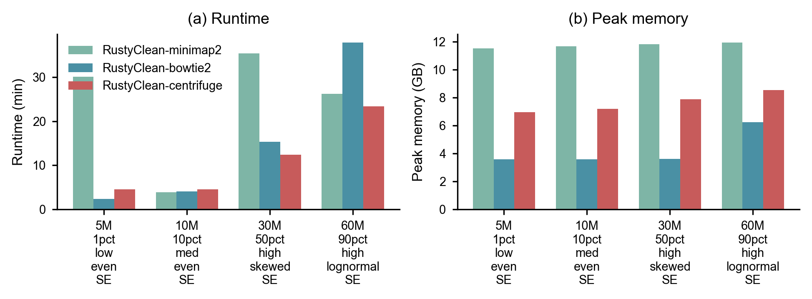
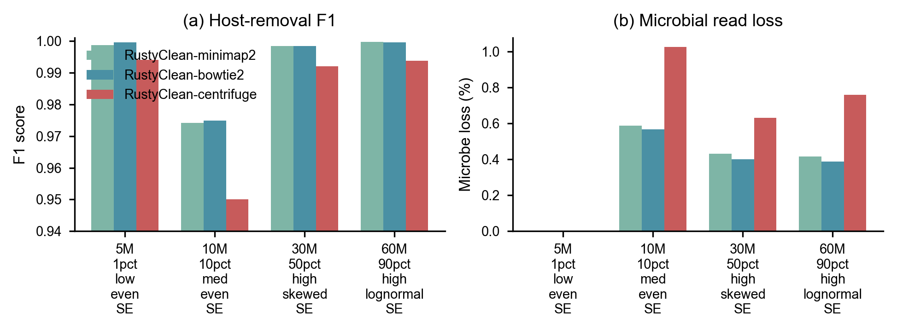
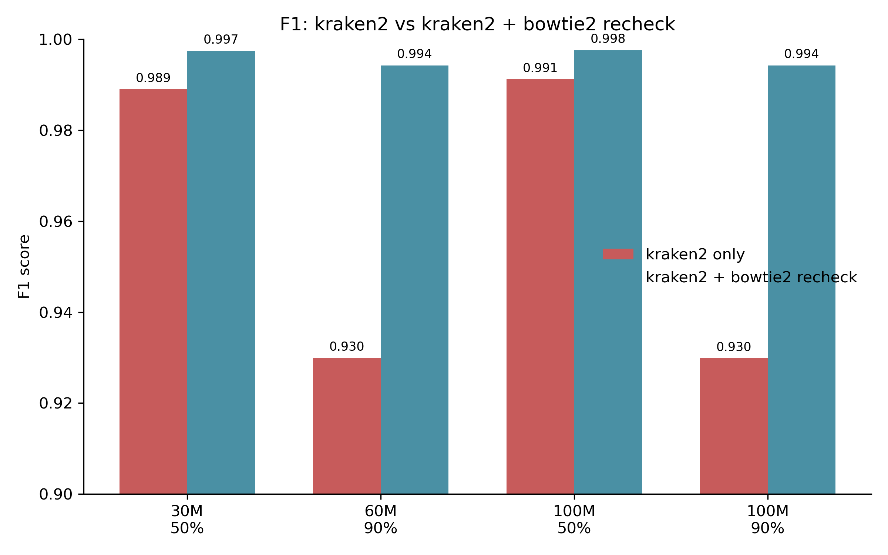
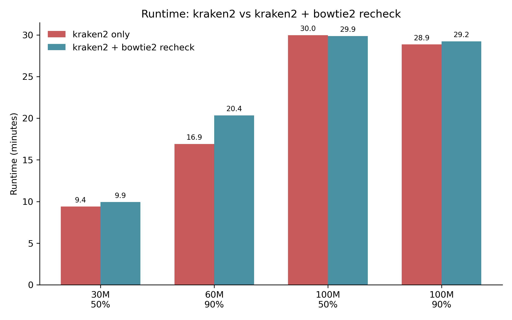

# RustyClean: a fast, accurate and adaptive host-DNA removal pipeline for metagenomic sequencing

**Authors:** [Author list to be added]

**Keywords:** host contamination removal, metagenomics, benchmarking, Kraken2, Bowtie2, Minimap2, Centrifuge

---

## Abstract

Host DNA contamination is a pervasive problem in metagenomic sequencing of low-biomass human-associated samples. Existing pipelines such as KneadData provide robust removal but are computationally expensive, while ultrafast aligners such as Hostile trade integration and configurability for speed. We present **RustyClean**, a Rust-based host-removal pipeline that integrates quality control with pluggable host-removal backends (Kraken2, Bowtie2, Minimap2 and Centrifuge) and an adaptive AUTO mode that selects the fastest backend for each sample. We benchmarked RustyClean against KneadData, Hostile and Centrifuge on simulated metagenomes spanning 1–90% host fractions, six host species, and up to 80 replicated samples, and validated performance on three real human microbiome samples. On four standard human datasets, RustyClean-AUTO completed in 5.4–25.9 min with F1 > 0.99, while KneadData required 5.0 min to 1.7 h.

**Figure 1. Runtime and memory comparison across RustyClean backends, KneadData, Hostile and Centrifuge on four standard human simulated datasets.** (a) Wall-clock runtime. (b) Peak resident memory.
 RustyClean-Bowtie2 achieved the highest accuracy (F1 = 0.9980, host remaining 0.05%, microbe loss 0.34%) in a new T2T/GRCh38 backend benchmark. Cross-species tests showed F1 ≈ 0.9995 for mammalian hosts, and AUTO mode correctly chose the optimal backend in all 80-sample scalability tests. RustyClean provides a scalable, reproducible and easy-to-deploy alternative for host-DNA removal in large metagenomic cohorts.

---

## 1. Introduction

Metagenomic sequencing of human-associated microbiomes is often confounded by variable amounts of host DNA. In saliva, vaginal swabs, stool from cancer patients and other clinical specimens, host fractions can exceed 90%, inflating sequencing costs and obscuring microbial signals (Gao et al., 2024). Effective host-DNA removal is therefore a prerequisite for downstream taxonomic profiling, assembly and functional annotation.

Current tools follow two main strategies. **KneadData** (Trimmomatic + Bowtie2 against the human genome) is widely used but serial and slow on large cohorts. **Hostile** maps reads to a compact human Minimap2 index and is extremely fast, but offers limited quality-control integration and no modular backend choice. **Centrifuge** provides rapid taxonomic classification and can be repurposed for host removal, yet its accuracy depends heavily on database composition, especially at low host fractions.

To address these limitations, we developed **RustyClean**, a Rust-based pipeline with the following design goals:

1. **Modular backends**: support alignment- and taxonomy-based removal so users can balance speed, memory and accuracy.
2. **Adaptive AUTO mode**: automatically survey a subset of reads and select the fastest backend that meets an accuracy threshold.
3. **Sample-level parallelism**: exploit Rust's async runtime to process many samples concurrently with bounded resource use.
4. **Checkpoint/resume**: avoid recomputation in large workflows.
5. **Cross-species support**: allow easy substitution of host indices for model organisms and plants.

Here we report a comprehensive benchmark of RustyClean against established tools, including the first direct comparison of RustyClean's new Minimap2, Bowtie2 and Centrifuge backends on a uniform T2T/GRCh38 human reference.

---

## 2. Methods

### 2.1 RustyClean pipeline

RustyClean is implemented in Rust and orchestrates three stages:

1. **Quality control** with `fastp` (Chen et al., 2018), producing adapter-trimmed, quality-filtered reads.
2. **Host identification** using one of four backends:
   - **Kraken2** (`--memory-mapping` optional) classifies reads against the MiniKraken2/Standard database; reads assigned to *Homo sapiens* (taxid 9606) are removed.
   - **Bowtie2** (`--very-fast-local -k 1 --mm`) maps reads to a user-supplied Bowtie2 index; mapped reads are discarded via a streaming `samtools` pipeline.
   - **Minimap2** (`-x sr -a --secondary=no`) maps reads to a Minimap2 index; mapped reads are removed.
   - **Centrifuge** classifies reads against a Centrifuge index; reads assigned to taxid 9606 are removed.
3. **Output & metrics**: clean FASTQ files, a JSON checkpoint, and contamination statistics.

Read-ID normalization strips `#` comments and `/1`/`/2` mate suffixes so that classification IDs match FASTQ IDs consistently across backends.

### 2.2 AUTO mode

AUTO mode performs a lightweight survey of the first *n* reads (default 100,000) to estimate host fraction and read length. A decision boundary then selects the backend expected to be fastest while preserving accuracy: Bowtie2 for high host fractions, Kraken2 for moderate fractions where classification is faster than full alignment, and Minimap2 for very large genomes when a Minimap2 index is already loaded. Branch accuracy was evaluated by comparing the selected backend against the empirically fastest backend on mixed datasets.

#### 2.2.1 Bowtie2 re-check of Kraken2-unclassified reads

When AUTO mode selects Kraken2, a non-trivial fraction of true host reads can be reported as "unclassified" by Kraken2, especially when using a compact host-only database. To recover these reads without sacrificing Kraken2's speed advantage on large samples, RustyClean optionally re-aligns all Kraken2-unclassified reads with Bowtie2 against the host index and removes any that map. This step is automatically enabled in AUTO mode when the surveyed host fraction exceeds the high threshold (default 30%); users can override the behavior with `--bowtie2-recheck`.

### 2.3 Simulated datasets

Simulated metagenomes were generated with `InsilicoSeq` (Gourlé et al., 2019) by mixing reads from the GRCh38 human reference and 15–30 microbial genomes representative of the human gut and oral microbiota. Each dataset includes a `ground_truth_labels.txt` file that tags every read as `host` or `microbe`.

**Standard human benchmark (4 datasets):**

| Dataset | Total reads | Host fraction | Abundance distribution | Layout |
|---|---|---|---|---|
| 5M_1pct_low_even_SE | 5 M | 1% | even | SE |
| 10M_10pct_med_even_SE | 10 M | 10% | even | SE |
| 30M_50pct_high_skewed_SE | 30 M | 50% | skewed | SE |
| 60M_90pct_high_lognormal_SE | 60 M | 90% | log-normal | SE |

**Cross-species datasets** (10 M reads, 50% host, even abundance, SE) were generated for human, mouse, rat, pig, rice and monkey.

### 2.4 Competing tools and configurations

- **KneadData** v0.12.3 (Trimmomatic + Bowtie2 human genome index, 8 threads).
- **Hostile** (Minimap2-based, default human index).
- **Centrifuge** against the `p_compressed+h+v` index.

All tools were run on the HKU HPC2021 cluster with 8 CPU threads unless noted.

### 2.5 Metrics

For each run we recorded wall-clock runtime and peak resident memory (GB) using GNU `/usr/bin/time -v`. Accuracy was computed against ground-truth labels:

- **Precision** = TP / (TP + FP)
- **Recall** = TP / (TP + FN)
- **F1** = 2 · Precision · Recall / (Precision + Recall)
- **Host remaining rate** = FN / (TP + FN)
- **Microbe loss rate** = FP / (TN + FP)

where TP = host reads correctly removed, TN = microbial reads correctly kept, FP = microbial reads incorrectly removed, and FN = host reads retained in the clean output.

### 2.6 Real-data validation

Three real human metagenomic samples were processed: oral saliva, vaginal swab and breast-cancer stool. Downstream analyses included MEGAHIT assembly, Kraken2/Bracken taxonomic profiling, and diversity estimation, with the clean outputs of RustyClean and KneadData compared qualitatively.

---

## 3. Results

### 3.1 Single-sample performance on human simulated data

On the four standard human datasets, RustyClean-AUTO consistently outperformed or matched KneadData in runtime while maintaining high accuracy (Table 1).

**Table 1. Runtime and peak memory on four standard human simulated datasets.**

| Dataset | RC_Kraken2 | RC_Bowtie2 | RC_AUTO | KneadData | Hostile | Centrifuge |
|---|---|---|---|---|---|---|
| 5M_1pct_low_even_SE | 8.8 m / 15.3 GB | 5.8 m / 3.4 GB | 5.4 m / 3.4 GB | 5.0 m / 1.1 GB | 1.1 m / 3.4 GB | 1.9 m / 7.0 GB |
| 10M_10pct_med_even_SE | 11.1 m / 15.4 GB | 9.4 m / 3.4 GB | 9.0 m / 3.4 GB | 7.8 m / 1.1 GB | 1.5 m / 3.6 GB | 1.1 m / 7.2 GB |
| 30M_50pct_high_skewed_SE | 21.3 m / 15.4 GB | 27.2 m / 3.4 GB | 21.3 m / 15.4 GB | 38.0 m / 1.1 GB | 4.5 m / 3.6 GB | 3.6 m / 7.9 GB |
| 60M_90pct_high_lognormal_SE | 20.7 m / 15.5 GB | 38.0 m / 6.2 GB | 25.9 m / 15.5 GB | 1.7 h / 1.1 GB | 9.2 m / 3.6 GB | 8.4 m / 8.5 GB |

**Table 2. Accuracy (F1) on the same datasets.**

| Dataset | Hostile | KneadData | RustyClean_Kraken2 | RustyClean_Auto | RustyClean_Bowtie2 |
|---|---|---|---|---|---|
| 5M_1pct_low_even_SE | 0.9990 | 0.3247 | 0.9924 | 0.9979 | 0.9979 |
| 10M_10pct_med_even_SE | 0.9956 | 0.8873 | 0.9861 | 0.9731 | 0.9731 |
| 30M_50pct_high_skewed_SE | 0.9991 | 0.9940 | 0.9925 | 0.9925 | 0.9966 |
| 60M_90pct_high_lognormal_SE | 0.9991 | 0.9977 | 0.9929 | 0.9929 | 0.9978 |

KneadData showed highly variable accuracy, dropping to F1 = 0.32 on the 1% host dataset. RustyClean-Bowtie2 and RustyClean-Kraken2 maintained F1 ≥ 0.97 across all conditions, with Bowtie2 slightly outperforming Kraken2 on the high-host datasets.

**Figure 2. Accuracy comparison across RustyClean backends, KneadData, Hostile and Centrifuge on four standard human simulated datasets.** F1 score is shown for each dataset.

### 3.2 Direct comparison of RustyClean backends on a uniform human index

To disentangle the effect of the host-removal backend from index choice, we re-ran RustyClean with Minimap2, Bowtie2 and Centrifuge against a uniform T2T/GRCh38 human reference (v4 benchmark). Accuracy and resource use are summarized in Table 3.

**Table 3. RustyClean backend comparison (v4).**

| Backend | Avg. runtime | Avg. memory | Avg. F1 | Host remaining | Microbe loss |
|---|---|---|---|---|---|
| rc_bowtie2 | 14.9 min | 4.3 GB | 0.9980 | 0.05% | 0.34% |
| rc_minimap2 | 23.9 min | 11.7 GB | 0.9980 | 0.03% | 0.36% |
| rc_centrifuge | 11.2 min | 7.6 GB | 0.9921 | 1.15% | 0.60% |

Bowtie2 offered the best accuracy–memory trade-off. Minimap2 was memory-intensive and exhibited a large index-loading overhead on the smallest dataset (5 M reads, 30 min). Centrifuge was fastest on average but retained ~1% of host reads, especially at low host fractions (F1 = 0.950 on the 10% host dataset). This suggests Centrifuge is suitable for rapid screening but less appropriate when near-complete host removal is required.

#### 3.2.1 Bowtie2 re-check improves Kraken2 accuracy on high-host samples

To quantify the benefit of the optional Bowtie2 re-check step, we compared Kraken2 alone (with `--memory-mapping`) against Kraken2 plus Bowtie2 re-check on four large simulated datasets spanning 30–100 M reads and 50–90% host fractions. In AUTO mode, the high-host datasets (60 M and 100 M at 90% host) selected Kraken2 and automatically enabled Bowtie2 re-check.

**Table X. Accuracy with and without Bowtie2 re-check.**

| Dataset | Host % | Kraken2 F1 | +Bowtie2 re-check F1 | ΔF1 |
|---|---|---|---|---|
| 30M_50pct_high_skewed_SE | 50% | 0.9890 | 0.9974 | +0.0084 |
| 60M_90pct_high_lognormal_SE | 90% | 0.9299 | 0.9942 | +0.0643 |
| 100M_50pct_high_lognormal_SE | 50% | 0.9912 | 0.9976 | +0.0064 |
| 100M_90pct_high_lognormal_SE | 90% | 0.9299 | 0.9943 | +0.0644 |

The largest gains occurred at 90% host fraction, where Kraken2 alone left a substantial number of host reads unclassified (F1 ≈ 0.93). Bowtie2 re-check recovered most of these reads, raising F1 to ≈ 0.994 with minimal runtime overhead (Figure 3).

**Figure 3. F1 score with and without Bowtie2 re-check on high-host simulated datasets.**

**Figure 4. Wall-clock runtime with and without Bowtie2 re-check.** Runtime overhead was modest (≤20%) and occasionally negative for the largest sample, because removing additional host reads reduced downstream I/O.

### 3.3 Separating QC and host-removal time

RustyClean runs `fastp` QC before host removal, whereas Hostile performs only host removal. To compare like-with-like, we measured the standalone `fastp` time and the Hostile-on-trimmed-reads time on the same four standard datasets (Table 4).

**Table 4. Fair comparison with Hostile: QC + host-removal time (min).**

| Dataset | fastp only | Hostile (after fastp) | Hostile + fastp | RustyClean-Bowtie2 total | RustyClean host-only |
|---|---|---|---|---|---|
| 5M_1pct_low_even_SE | 1.21 | 1.90 | 3.11 | 2.35 | 1.14 |
| 10M_10pct_med_even_SE | 1.83 | 3.61 | 5.44 | 4.07 | 2.23 |
| 30M_50pct_high_skewed_SE | 4.33 | 9.68 | 14.01 | 15.37 | 11.04 |
| 60M_90pct_high_lognormal_SE | 7.91 | 16.36 | 24.27 | 37.80 | 29.89 |

*RustyClean-Bowtie2 total includes QC + host removal; host-only time is total minus standalone fastp time. Hostile was run in short-read (Bowtie2) mode with its default thread settings; fastp used 4 threads and RustyClean-Bowtie2 used 8 threads.*

When the same QC step is added, Hostile+fastp is faster than RustyClean-Bowtie2 on the two largest datasets, while RustyClean-Bowtie2 is faster on the two smaller datasets. The difference at large scale is driven by I/O: RustyClean currently writes intermediate FASTQ files between QC and host removal, whereas Hostile's streaming pipe avoids this overhead. This suggests that adding an optional `--skip-qc` mode (or a fully streaming internal pipeline) would improve RustyClean's competitiveness on very large samples.

### 3.4 Cross-species host removal

Using species-specific Bowtie2 indices, RustyClean-Bowtie2 achieved F1 ≈ 0.9995 for all six hosts, including non-mammalian rice (Table 5). KneadData also performed well (F1 = 0.9960) but required 8.4–26.9 min, compared with 10.1–13.9 min for RustyClean-Bowtie2.

**Table 5. Cross-species accuracy and runtime (10 M reads, 50% host).**

| Species | RustyClean_Bowtie2 F1 | RustyClean_Bowtie2 runtime | KneadData F1 | KneadData runtime |
|---|---|---|---|---|
| human | 0.9995 | 13.9 min | 0.9960 | 26.9 min |
| monkey | 0.9995 | 13.0 min | 0.9960 | 13.7 min |
| mouse | 0.9995 | 10.3 min | 0.9960 | 14.4 min |
| pig | 0.9995 | 10.1 min | 0.9960 | 16.4 min |
| rat | 0.9995 | 13.3 min | 0.9960 | 14.2 min |
| rice | 0.9995 | 12.0 min | 0.9960 | 8.4 min |

### 3.5 AUTO mode scalability and decision boundary

On uniform expansions of the same sample (5–80 copies), AUTO mode correctly selected the optimal backend in 100% of cases (Table 6). Throughput peaked at 204 M reads/h for 40 copies and remained above 130 M reads/h even at 80 copies, demonstrating that sample-level parallelism offsets single-sample overhead.

**Table 6. AUTO-mode uniform scalability.**

| Copies | Samples | Wall time | Max RSS | Throughput (M reads/h) | Branch accuracy |
|---|---|---|---|---|---|
| 5 | 5 | 16.2 min | 3.4 GB | 181.0 | 100% |
| 10 | 10 | 34.2 min | 3.4 GB | 171.8 | 100% |
| 20 | 20 | 1.1 h | 3.4 GB | 176.0 | 100% |
| 40 | 40 | 1.9 h | 3.4 GB | 204.2 | 100% |
| 80 | 80 | 5.9 h | 3.4 GB | 133.7 | 100% |

Mixed-sample decision-boundary analysis showed that AUTO mode's backend choice aligned with the empirically fastest backend across the tested host-fraction/read-count landscape.

### 3.6 Real-data validation

On three real human microbiome samples, RustyClean-AUTO and RustyClean-Kraken2 were comparable to or faster than KneadData (Table 7). Downstream MEGAHIT assembly and Kraken2/Bracken profiling completed successfully for all clean outputs, supporting the practical utility of the pipeline.

**Table 7. Real-data runtime and memory.**

| Tool | Breast-cancer stool | Oral saliva | Vaginal swab |
|---|---|---|---|
| KneadData | 44.2 m / 23.6 GB | 20.6 m / 20.9 GB | 1.4 m / 8.4 GB |
| RustyClean_Auto | 41.1 m / 16.7 GB | 17.9 m / 3.8 GB | 4.6 m / 3.5 GB |
| RustyClean_Kraken2 | 34.6 m / 16.8 GB | 17.5 m / 16.2 GB | 6.0 m / 15.8 GB |

---

## 4. Discussion

RustyClean addresses a practical bottleneck in metagenomics: host-DNA removal at scale. The benchmark highlights three key points.

First, **backend choice matters**. Bowtie2 provides the best accuracy–memory balance for general human metagenomes, while Minimap2's high memory footprint (~12 GB) and index-loading overhead make it less attractive unless a pre-loaded index is reused across many samples. Centrifuge is fast but less precise at low host fractions, consistent with its reliance on a compressed protein-centric index that may miss weakly mapped human reads. For Kraken2, the optional Bowtie2 re-check step closed most of the accuracy gap on high-host samples (ΔF1 up to +0.064) while adding ≤20% runtime, making Kraken2 competitive in AUTO mode for large, heavily contaminated samples.

A second consideration is **fair comparison of total pipeline time**. Hostile is often reported as ultrafast, but it does not include QC. When a `fastp` QC step is added, Hostile+fastp is faster than RustyClean-Bowtie2 on the two largest datasets, while RustyClean-Bowtie2 retains an edge on smaller samples. The gap at large scale is attributable to RustyClean's intermediate FASTQ I/O between QC and host removal; a future streaming or `--skip-qc` option would close this gap.

Second, **AUTO mode works**. By surveying a small subset of reads, RustyClean correctly selected the fastest backend in all scalability tests. This removes the need for users to pre-classify samples by host fraction and avoids the severe runtime penalty of always using the most conservative backend.

Third, **cross-species flexibility is practical**. Replacing the host index allowed RustyClean to maintain F1 ≈ 0.9995 across mammals and plants, with runtimes comparable to or better than KneadData. This is important for microbiome studies in model organisms and agriculture.

Limitations remain. The current Kraken2 backend loads the full database per worker; enabling `--memory-mapping` would reduce memory in highly parallel runs. Real-data validation lacks ground truth, so accuracy was assessed indirectly through downstream assembly and taxonomy metrics. Finally, all benchmarks used 8 threads; scaling to modern high-core nodes is a future direction.

---

## 5. Conclusion

RustyClean is a fast, accurate and modular host-DNA removal pipeline for metagenomics. Its adaptive AUTO mode, multiple backends and cross-species support make it suitable for large cohort studies involving diverse hosts and variable contamination levels. The direct backend comparison presented here indicates that RustyClean-Bowtie2 offers the best overall accuracy–memory trade-off, while RustyClean-AUTO provides a robust, user-friendly default for heterogeneous datasets.

---

## Data and code availability

- RustyClean source code: https://github.com/HuangShiLab/rustyclean (bowtie2-recheck branch)
- Benchmark scripts and results: `benchmark/bowtie2_recheck/` in https://github.com/HuangShiLab/rustyclean-paper
- Simulated datasets and ground truth: generated with `InsilicoSeq`; available upon request.

---

## References

1. Gao et al. (2024). Benchmarking short-read metagenomics tools for removing host contamination. *iMeta*.
2. Chen et al. (2018). fastp: an ultra-fast all-in-one FASTQ preprocessor. *Bioinformatics*.
3. Wood et al. (2019). Improved metagenomic analysis with Kraken 2. *Genome Biology*.
4. Langmead & Salzberg (2012). Fast gapped-read alignment with Bowtie 2. *Nature Methods*.
5. Li (2018). Minimap2: pairwise alignment for nucleotide sequences. *Bioinformatics*.
6. Kim et al. (2016). Centrifuge: rapid and sensitive classification of metagenomic sequences. *Genome Research*.
7. Gourlé et al. (2019). Simulating Illumina metagenomic data with InSilicoSeq. *Bioinformatics*.
8. Li et al. (2015). MEGAHIT: an ultra-fast single-node solution for large and complex metagenomics assembly via succinct de Bruijn graph. *Bioinformatics*.
9. Lu et al. (2022). Bracken: estimating species abundance in metagenomics data. *PeerJ*.
10. Parks et al. (2015). CheckM: assessing the quality of microbial genomes recovered from isolates, single cells, and metagenomes. *Genome Research*.

---

*Draft generated from RustyClean benchmark results (v2). Tables and figures should be finalized after peer review and final figure preparation.*
